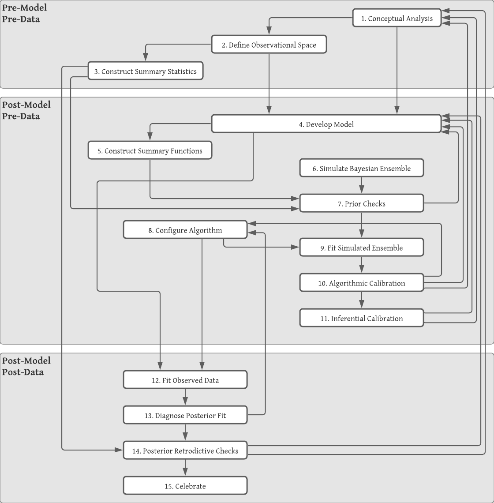

```{r ch030-setup, include=FALSE}
library(tidyverse)
library(kableExtra)
library(rstan)
library(patchwork)
library(bayesplot)
library(rethinking)
library(loo)
```


# Background {#methods}


## Bayesian single-level GLM


## Bayesian multilevel GLM


- Pooling
  - none
  - partial
  - complete


## A modern principled bayesian modeling workflow


A principled workflow is a method of employing domain expertise and statistical knowledge to iteratively build a statistical model that satisfies the constraints and goals set forth by the researcher. Many other workflow and model checking techniques are given without context for when they are appropriate, and according to @betancourt2020, this leaves "practitioners to piece together their own model building workflows from potentially incomplete or even inconsistent heuristics." For any given problem, there is not, nor should there be, a default set of steps to take to get from data exploration to predictive inferences. Rather, consideration must be given to domain expertise and the questions that one is trying to answer with the statistical model.


Because everyone asks different questions, the value of a model is not in how well it ticks the boxes of goodness-of-fit checks, but in how consistent it is with domain expertise and its ability to answer the unique set of questions. Betancourt suggests answering four questions to evaluate a model by, summarized in table \@ref(tab:ch030-Confidential-Proton).


```{r ch030-Confidential-Proton}
data.frame(
  Evaluation = c(
    "1. Domain Expertise Consistency",
    "2. Computational Faithfulness",
    "3. Inferential Adequacy",
    "4. Model Adequacy"
  ),
  Question = c(
    "Is our model consistent with our domain expertise?",
    "Will our computational tools be sufficient to accurately fit our posteriors?",
    "Will our inferences provide enough information to answer our questions?",
    "Is our model rich enough to capture the relevant structure of the true data generating process?"
  )
) %>%
  kable(booktabs=TRUE, caption = "Questions for model evaluation.") %>%
  kable_styling(latex_options = c("hold_position", "striped")) %>%
  column_spec(1, width = "1.75in") %>%
  column_spec(2, width = "3.25in")
```


Much work is done before seeing the data or building a model. This includes talking with experts to gain domain knowledge or to elicit priors. A benefit of modeling in a Bayesian framework is that all prior knowledge may be incorporated into the model to be used to estimate the posterior distribution. The same prior knowledge may also be used to check the posterior to ensure that predictions remain within physical or expert-given constraints.


In this section we describe a simulation-based, principled workflow proposed by @betancourt2020 and broadly adopted by many members of the Bayesian community. The workflow broadly consists of specifying the likelihood and prior, performing prior predictive checks, fitting a model, and performing posterior predictive checks. Table \@ref(tab:ch030-workflow-steps) lists the detailed steps broken up into three phases.


```{r ch030-workflow-steps}
bind_rows(
  data.frame(Phase = "Pre-Model, Pre-Data",
             Step = c("conceptual analysis", 
                      "define observational space",
                      "construct summary statistics")),
  data.frame(Phase = "Post-Model, Pre-Data",
             Step = c("develop model",
                      "construct summary functions",
                      "simulate Bayesian ensemble",
                      "prior checks",
                      "configure algorithm",
                      "fit simulated ensemble",
                      "algorithmic calibration",
                      "inferential calibration")),
  data.frame(Phase = "Post-Model, Post-Data",
             Step = c("fit observed data",
                      "diagnose posterior fit",
                      "posterior retrodictive checks",
                      "celebrate"))
) %>%
  kable(digits = 2, 
        caption = "Principled workflow", booktabs = TRUE) %>%
  kable_styling(latex_options = c("hold_position")) %>%
  collapse_rows(columns = 1, valign = "top")
```


These steps are not meant to be followed in a strictly linear fashion. If a conceptual misunderstanding is discovered at any step in the process, then it is recommended to go back to an earlier step and start over. The workflow is a process of model expansion, and multiple iterations are required to get to a final model (or collection of models). Similarly if the model fails prior predictive checks, then one may need to return to the model development step. A full diagram of the workflow is displayed in figure \@ref(fig:ch030-workflow-diagram).


<!--
The modeling process begins by modeling the experiment according to the description of how it occurred and how the data were collected. The first part consists of conceptual analysis, defining the observational space, and constructing summary statistics that can help identify issues in the model specification. 
-->


```{r ch030-Reborn-Space}
data.frame(Step = c("Conceptual Analysis", 
                    "Define Observational Space",
                    "Construct Summary Statistics"),
           Description = c("Write down the inferential goals and consider how the variables of interest interact with the environment and how those interactions work to generate observations.",
                           "What are the possible values that the observed data can take on? The observational space can help inform the statistical model such as in count data.",
                           "What measurements and estimates can be used to help ensure that the inferential goals are met? Prior predictive checks and posterior retrodictive checks are founded on summary statistics that answer the questions of domain expertise consistency and model adequacy.")) %>%
  kable(booktabs=TRUE, caption="Pre-Model, Pre-Data steps.") %>%
  kable_styling(latex_options = c("hold_position", "striped")) %>%
  column_spec(1, width = "1.75in") %>%
  column_spec(2, width = "3.25in")
```


```{r ch030-Freaky-Sledgehammer}
data.frame(Step = c("Develop Model",
                    "Construct Summary Functions",
                    "Simulate Bayesian Ensemble",
                    "Prior Checks",
                    "Configure Algorithm",
                    "Fit Simulated Ensemble",
                    "Algorithmic Calibration",
                    "Inferential Calibration"),
           Description = c(
             "Build an observational model that is consistent with the conceptual analysis and observational space, and then specify the complementary prior model.",
             "Use the developed model to construct explicit summary functions that can be used in prior predictive checks and posterior retrodictive checks.",
             "Since the model is a data generating model, it can be used to simulate observations from the prior predictive distribution without yet having seen any data.",
             "Check that the prior predictive distribution is consistent with domain expertise using the summary functions developed in the previous step.",
             "Having simulated data, the next step is to fit the data generating model to the generated data. There are many different MCMC samplers with their own configurable parameters, so here is where those settings are tweaked.",
             "Fit the simulated data to the model using the algorithm configured in the previous step.",
             "How well did the algorithm do in fitting the simulated data? This step helps to answer the question regarding computational faithfulness. A model may be well specified, but if the algorithm used is unreliable then the posterior distribution is also unreliable, and this can lead to poor inferences. Methods for checking models is discussed in (#model-checking).",
             "Are there any pathological behaviors in the model such as overfitting or non-identifiability? This step helps to answer the question of inferential adequacy."
             )) %>%
  kable(booktabs=TRUE, caption="Post-Model, Pre-Data steps.") %>%
  kable_styling(latex_options = c("hold_position", "striped")) %>%
  column_spec(1, width = "1.75in") %>%
  column_spec(2, width = "3.25in")
```


```{r ch030-Bleeding-Liquid-Dagger}
data.frame(Step = c("Fit Observed Data",
                    "Diagnose Posterior Fit",
                    "Posterior Retrodictive Checks",
                    "Celebrate"),
           Description = c(
             "After performing the prior predictive checks and being satisfied with the model, the next step is to fit the model to the observed data.",
             "Did the model fit well? Can a poorly performing algorithm be fixed by tweaking the algorithmic configuration, or is there a problem with the model itself where it is not rich enough to capture the structure of the observed data? Utilize the diagnostic tools available for the algorithm to check the computational faithfulness.",
             "Do the posterior retrodictions match the observed data well, or are there still apparent discrepancies between what is expected and what is predicted by the model? It is important that any changes to the model going forward are motivated by domain expertise so as to mitigate the risk of overfitting.",
             "After going through the tedious process of iteratively developing a model, it is okay to celebrate before moving on to answer the research questions."
           )) %>%
  kable(booktabs=TRUE, caption="Post-Model, Post-Data steps.") %>%
  kable_styling(latex_options = c("hold_position", "striped")) %>%
  column_spec(1, width = "1.75in") %>%
  column_spec(2, width = "3.25in")
```


```{r ch030-workflow-diagram, fig.cap="Diagram is copywrited material of Michael Betancourt and used under the CC BY-NC 4.0 license. Image created with Lucid app.", out.width="100%"}

```


\clearpage
## Methods for model checking {#model-checking}


Below is the 8 Schools data [@gelman2013bayesian] which is a standard textbook example for introducing multilevel modeling. Here we use it to illustrate essential MCMC model checking tools.


```{r ch030-Digital Knife, echo=TRUE}
schools_dat <- list(
  J = 8,
  y = c(28,  8, -3,  7, -1,  1, 18, 12),
  sigma = c(15, 10, 16, 11,  9, 11, 10, 18)
)
```


```{stan ch030-Rusty Limousine, output.var="schools"}
data {
  int<lower=0> J;         // number of schools 
  real y[J];              // estimated treatment effects
  real<lower=0> sigma[J]; // standard error of effect estimates 
}
parameters {
  real mu;                // population treatment effect
  real<lower=0> tau;      // standard deviation in treatment effects
  vector[J] eta;          // unscaled deviation from mu by school
}
transformed parameters {
  vector[J] theta = mu + tau * eta; // school treatment effects
}
model {
  target += normal_lpdf(eta | 0, 1);       // prior log-density
  target += normal_lpdf(y | theta, sigma); // log-likelihood
}
generated quantities {
  vector[J] log_lik;

  for (j in 1:J) {
    log_lik[j] = normal_lpdf(y[j] | theta[j], sigma[j]);
  }
}
```


```{stan ch030-Mercury Rainbow, output.var="schools_cp"}
data {
  int<lower=0> J;
  vector[J] y;
  vector<lower=0>[J] sigma;
}
parameters {
  real mu;
  real<lower=0> tau;
  vector[J] theta;
}
model {
  mu ~ normal(0, 10);
  tau ~ cauchy(0, 10);
  theta ~ normal(mu, tau);
  y ~ normal(theta, sigma);
}
generated quantities {
  vector[J] log_lik;

  for (j in 1:J) {
    log_lik[j] = normal_lpdf(y[j] | theta[j], sigma[j]);
  }
}
```


```{stan ch030-Jupiter Wild, output.var="schools_ncp"}
data {
  int<lower=0> J;
  vector[J] y;
  vector<lower=0>[J] sigma;
}
parameters {
  real mu;
  real<lower=0> tau;
  vector[J] eta;
}
transformed parameters {
  vector[J] theta;
  theta = mu + tau * eta;
}
model {
  mu ~ normal(0, 10);
  tau ~ cauchy(0, 10);
  eta ~ normal(0, 1); // implies theta ~ normal(mu, tau)
  y ~ normal(theta, sigma);
}
generated quantities {
  vector[J] log_lik;

  for (j in 1:J) {
    log_lik[j] = normal_lpdf(y[j] | theta[j], sigma[j]);
  }
}
```


```{r ch030-Mysterious Python}
m_schools <- sampling(schools, data = schools_dat,
                      refresh = 0, seed = 1234125)
p_schools <- as.array(m_schools)
```


**Trace Plots.** Trace plots have been used since the conception of MCMC to assess chain sampling efficiency and quality. They are visual aids that let the practitioner asses the qualitative health of the chains, looking for properties such as autocorrelation, heteroskedacity, non-stationarity, and convergence. Healthy chains are well-mixed and stationary. It's often better to run more chains during the model building process so that issues with mixing and convergence can be diagnosed sooner. One unhealthy chain can be indicative of a poorly specified model. The addition of more chains also contributes to the estimation of the split $\hat{R}$ statistic (discussed below). Figure \@ref(fig:ch030-Brave-Moose) shows what a set of healthy chains looks like.


```{r ch030-Brave-Moose, fig.cap="An example of healthy chains."}
mcmc_trace(p_schools, pars = c("mu", "tau"))
```


As the number of parameters in a model grows, it becomes exceedingly tedious to check the trace plots of all parameters, and so numerical summaries are helpful to flag potential issues within the model.


**R-hat Statistic.** The most common summary statistic for chain health is the potential scale reduction factor [@gelman1992inference] that measures the ratio of between chain variance and within chain variance. When the two have converged, the ratio is one. I've already shared examples of healthy chains which would also have healthy $\hat{R}$ values, but it's valuable to also share an example of a bad model. Below is the 8 Schools example [@gelman2013bayesian] which is a classical example for introducing Stan and testing the operating characteristics of a model. 


The initial starting parameters for this model are intentionally set to vary between $-10$ and $10$ (in contrast to the default range of $(-2, 2)$) and with only a few samples drawn in order to artificially drive up the split $\hat{R}$ statistic. The model is provided as supplementary code in the [appendix](#code).


```{r ch030-Eager Galaxy, echo=TRUE}
fit_cp <- sampling(schools_cp, data = schools_dat, refresh = 0,
                   iter = 40, init_r = 10, seed = 671254821)
```


Stan warns about many different issues with this model, but the R-hat is the one of interest. The largest is $1.71$ which is incredibly large.


```{r ch030-Rocky-Test}
p_cp <- as.array(fit_cp)
mcmc_trace(p_cp, pars = c("mu", "tau"))
```


These chains do not look good at all. The $\hat{R}$ values are listed in table \@ref(tab:ch030-Ninth-Finger).


```{r ch030-Ninth-Finger}
rhat(fit_cp) %>% t %>% t %>% 
  as_tibble(rownames = "Parameter") %>%
  rename("Rhat" = V1) %>%
  head(2) %>%
  kable(booktabs = TRUE, caption = "Split R-hat values from the 8 Schools example.") %>%
  kable_styling(latex_options = "hold_position")
```


To calculate the (non split) $\hat{R}$, first calculate the between-chain variance, and then the average chain variance. For $M$ independent Markov chains, $\theta_m$, with $N$ samples each, the between-chain variance is


\setstretch{1.0}
$$
B = \frac{N}{M-1}\sum_{m=1}^{M}\left(\bar{\theta}_m - \bar{\theta}\right)^2
$$


where


$$
\bar{\theta}_m = \frac{1}{N}\sum_{n=1}^{N}\theta_{m}^{(n)}
$$


and


$$
\bar{\theta} = \frac{1}{M}\sum_{m=1}^{M}\bar{\theta}_m
$$


The within-chain variance, $W$, is the variance averaged over all the chains.


$$
W = \frac{1}{M}\sum_{m=1}^{M} s_{m}^2
$$


where


$$
s_{m}^2 = \frac{1}{N-1}\sum_{n=1}^{N}\left(\theta_{m}^{(n)} - \bar{\theta}_m\right)^2
$$


The variance estimator is a weighted mixture of the within-chain and cross-chain variation


$$
\hat{var} = \frac{N-1}{N} W + \frac{1}{N} B
$$


and finally


$$
\hat{R} = \sqrt{\frac{\hat{var}}{W}}
$$


Here is the calculation in `R`:


```{r ch030-Steamy Eyelid, echo=TRUE}
param <- "mu"
theta <- p_cp[,,param]
N     <- nrow(theta)
M     <- ncol(theta)

theta_bar_m <- colMeans(theta)
theta_bar   <- mean(theta_bar_m)

B <- N / (M - 1) * sum((theta_bar_m - theta_bar)^2)
s_sq_m <- apply(theta, 2, var)

W <- mean(s_sq_m)
var_hat <- W * (N - 1) / N + B / N

(mu_Rhat <- sqrt(var_hat / W))
```
\setstretch{2.0}


The $\hat{R}$ statistic is smaller than the split $\hat{R}$ value provided by `Stan`. This is a consequence of steadily increasing or decreasing chains. The split value does what it sounds like, and splits the samples from the chains in half -- effectively doubling the number of chains and halving the number of samples per chain. In this way, the measure is more robust in detecting unhealthy chains. This also highlights the utility in using both visual and statistical tools to evaluate models. Here is the calculation of the split $\hat{R}$:


```{r ch030-Steady Brave Windshield, echo=TRUE}
param <- "mu"
theta_tmp <- p_cp[,,param]
theta <- cbind(theta_tmp[1:10,], theta_tmp[11:20,])
N     <- nrow(theta)
M     <- ncol(theta)

theta_bar_m <- colMeans(theta)
theta_bar   <- mean(theta_bar_m)

B <- N / (M - 1) * sum((theta_bar_m - theta_bar)^2)
s_sq_m <- apply(theta, 2, var)

W <- mean(s_sq_m)
var_hat <- W * (N - 1) / N + B / N

(mu_Rhat <- sqrt(var_hat / W))
```


We've successfully replicated the calculation of the split $\hat{R}$. @vehtari2020rank propose an improved rank-normalized $\hat{R}$ for assessing the convergence of MCMC chains, and also suggest using a threshold of $1.01$ rather than the $1.10$ threshold originally suggested by Gelmen for the split $\hat{R}$.


**Effective Sample Size.** Samples from Markov Chains are typically autocorrelated, which can increase uncertainty of posterior estimates. The solution is generally to reparameterize the model to avoid steep log-posterior densities, and the benefit of reparameterization is conveyed by the ratio of effective sample size to actual sample size in figure \@ref(fig:ch030-Timely-Nitrogen). When the HMC algorithm is exploring difficult geometry, it can get stuck in regions of high densities, which means that there is more correlation between successive samples. 


```{r ch030-Third Tuna}
fit_cp <- sampling(schools_cp, data = schools_dat, refresh = 0,
                   seed = 1734652)
fit_ncp <- sampling(schools_ncp, data = schools_dat, refresh = 0,
                    seed = 783652)
```


```{r ch030-Timely-Nitrogen, fig.cap="Ratio of N\\_eff to actual sample size. Low ratios imply high autocorrelation which can be alleviated by reparameterizing the model or by thinning."}
cp_neff <- neff_ratio(fit_cp, pars = c("theta", "mu", "tau"))
ncp_neff <- neff_ratio(fit_ncp, pars = c("theta", "mu", "tau"))
p_ncp <- mcmc_neff(ncp_neff) + 
  labs(title = "Non-centered Parameterization")
p_cp <- mcmc_neff(cp_neff) + 
  labs(title = "Centered Parameterization")
p_cp / p_ncp
```


As the strength of autocorrelation generally decreases at larger lags, a simple prescription to decrease autocorrelation between samples and increase the effective sample size is to use thinning. Thinning means saving every $k^{th}$ sample and throwing the rest away. If one desired to have 2000 posterior draws, it could be done in two of many possible ways


- Generate 2000 draws after warmup and save all of them
- Generate 10,000 draws after warmup and save every $5^{th}$ sample. 


Both will produce 2000 samples, but the method using thinning will have less autocorrelation and a higher effective number of samples. Though it should be noted that generating 10,000 draws and saving all of them will have a higher number of effective samples than the second method with thinning, so thinning should only be favored to save memory.


**Divergent Transitions.** Unlike the previous tools for algorithmic faithfulness which can be used for any MCMC sampler, information about divergent transitions is intrinsic to Hamiltonian Monte Carlo. Recall that the HMC and NUTS algorithm can be imagined as a physics simulation of a particle in a potential energy field, and a random momentum is imparted on the particle. The sum of the potential energy and the kinetic energy of the system is called the Hamiltonian, and is conserved along the trajectory of the particle [@stanref]. The path that the particle takes is a discrete approximation to the actual path where the position of the particle is updated in small steps called leapfrog steps (see @leimkuhler2004simulating for a detailed explanation of the leapfrog algorithm). A divergent transition happens when the simulated trajectory is far from the true trajectory as measured by the Hamiltonian.


A few divergent transitions is not indicative of a poorly performing model, and often divergent transitions can be mitigated by reducing the step size and increasing the adapt delta parameter. On the other hand, a bad model may never be improved just by tweaking some parameters. This is the folk theorem of statistical computing - if there is a problem with the sampling, blame the model, not the algorithm.


Divergent transitions are never saved in the posterior samples, but they are saved internally to the `Stan` fit object and can be compared against good samples. Sometimes this can give insight into which parameters and which regions of the posterior the divergent transitions are coming from.


```{r ch030-Hot-Locomotive, fig.cap="Divergent transitions highlighted for some parameters from the centered parameterization of the eight schools example."}
n_cp <- nuts_params(fit_cp)
post_cp <- as.array(fit_cp)
mcmc_pairs(post_cp, np = n_cp, pars = c("mu", "tau"))
```


From figure \@ref(fig:ch030-Hot-Locomotive) we can see that most of the divergent transitions occur when the variance term $\tau$ is close to zero. This is common for multilevel models, and illustrates why non-centered parameterization is so important. We discuss centered and non-centered parameterization in the next chapter.


## Estimating predictive performance


All models are wrong, but some are useful. This quote is from George Box, and it is a popular quote that statisticians like to throw around. All models are wrong because it is nearly impossible to account for the minutiae of every process that contributes to an observed phenomenon, and often trying to results in poorer performing models. Also it is never truly possible to prove that a model is correct. At best the scientific method can falsify certain hypotheses, but it cannot ever determine if a model is universally correct. That does not matter. What does matter is if the model is useful and can make accurate predictions.


Why is predictive performance so important? Consider five points of data (figure \@ref(fig:ch030-Moving-Moose)). They have been simulated from some polynomial equation of degree less than five, but with no more information other than that, how can the best polynomial model be selected?


```{r ch030-Moving-Moose, fig.cap="Five points from a polynomial model."}
set.seed(11)
i <- 2
x0 <- 0:5
y0 <- -0.5*(x0 - 2)^2 + 2 + rnorm(length(x0), 0, 1)
x <- x0[-i]
y <- y0[-i]
p <- ggplot(data.frame(x=x, y=y), aes(x, y)) + 
  geom_point(size = 4) +
  theme_minimal()
p
```

One thing to try is fit a handful of linear models, check the parameter's p-values, the $R^2$ statistic, and perform other goodness of fit tests, but there is a problem. As the degree of the polynomial fit increases, the $R^2$ statistic will always increase. In fact with five data points, a fourth degree polynomial will fit the data perfectly (figure \@ref(fig:ch030-Olive-Screwdriver)).


```{r ch030-Olive-Screwdriver, fig.cap="Data points with various polynomial regression lines."}
p2 <- p +
  geom_smooth(formula = y ~ 1 + x, 
              method = "lm", se = FALSE,
              aes(color = "Linear")) +
  geom_smooth(formula = y ~ 1 + x + I(x^2), 
              method = "lm", se = FALSE,
              aes(color = "Quadratic")) +
  geom_smooth(formula = y ~ 1 + x + I(x^2) + I(x^3), 
              method = "lm", se = FALSE,
              aes(color = "Cubic")) +
  geom_smooth(formula = y ~ 1 + x + I(x^2) + I(x^3) + I(x^4), 
              method = "lm", se = FALSE,
              aes(color = "Quartic")) +
  geom_point(size = 4) +
  scale_color_manual(values = c("#20639B",
                                "#3CAEA3",
                                "#F6D55C",
                                "#ED553B"),
                     limits = c("Linear",
                                "Quadratic",
                                "Cubic",
                                "Quartic"),
                     labels = c("Linear",
                                "Quadratic",
                                "Cubic",
                                "Quartic"),
                     name = "Degree")
p2
```


If a $6^{th}$ point were to be added -- a new observation -- which of the models would be expected to predict best? Can it be estimated which model will predict best before testing with new data? One guess is that the quadratic or cubic model will do well because because the linear model is potentially _underfit_ to the data and the quartic is _overfit_ to the data. Figure \@ref(fig:ch030-Cold-Fish) shows the new data point from the polynomial model. Now the linear and cubic models are trending in the wrong direction. The quadratic and quartic models are both trending down, so perhaps they may be the correct form for the model.


```{r ch030-Cold-Fish, fig.cap="The fitted polynomial models with a new observation."}
p2 + 
  geom_point(data = data.frame(x = x0[i], y = y0[i]),
             shape = 17, size = 4)
```


Figure \@ref(fig:ch030-Strawberry-Swallow) shows the 80% and 95% prediction intervals for a new observation given $x = `r x0[i]`$ as well as the true outcome as a dashed line at $y = `r round(y0[i], 3)`$. The linear model has the smallest prediction interval (PI), but completely misses the target. The remaining three models all include the observed value in their 95% PIs, but the quadratic model has the smallest PI of the three. The actual data generating polynomial is


\begin{align*}
y &\sim \mathcal{N}(\mu, 1^2) \\
\mu &= -0.5(x - 2)^2 + 2
\end{align*}


```{r ch030-Maximum Panther, include=FALSE}
d <- data.frame(y = y,
          x = x,
          x2 = x^2,
          x3 = x^3,
          x4 = x^4)

m1 <- xfun::cache_rds({
  ulam(alist(
    y ~ dnorm(mu, sigma),
    mu <- a + b1*x,
    c(a, b1) ~ dnorm(0, 2),
    sigma ~ dexp(1)
  ), data = d, log_lik=TRUE)
})
m2 <- xfun::cache_rds({
  ulam(alist(
    y ~ dnorm(mu, sigma),
    mu <- a + b1*x + b2*x2,
    c(a, b1, b2) ~ dnorm(0, 2),
    sigma ~ dexp(1)
  ), data = d, log_lik=TRUE)
})
m3 <- xfun::cache_rds({
  ulam(alist(
    y ~ dnorm(mu, sigma),
    mu <- a + b1*x + b2*x2 + b3*x3,
    c(a, b1, b2, b3) ~ dnorm(0, 2),
    sigma ~ dexp(1)
  ), data = d, log_lik=TRUE)
})
m4 <- xfun::cache_rds({
  ulam(alist(
    y ~ dnorm(mu, sigma),
    mu <- a + b1*x + b2*x2 + b3*x3 + b4*x4,
    c(a, b1, b2, b3, b4) ~ dnorm(0, 2),
    sigma ~ dexp(1)
  ), data = d, log_lik=TRUE)
})
```


```{r ch030-Strawberry-Swallow, fig.cap="95\\% Prediction intervals for the four polynomial models, as well as the true value (dashed line)."}
new_y <- y0[i]
new_x <- x0[i]
new_dat <- data.frame(x  = new_x,
                      x2 = new_x^2,
                      x3 = new_x^3,
                      x4 = new_x^4)
bind_rows(
  round(PI(link(m1, data = new_dat), prob = c(0.8, 0.95)), 3),
  round(PI(link(m2, data = new_dat), prob = c(0.8, 0.95)), 3),
  round(PI(link(m3, data = new_dat), prob = c(0.8, 0.95)), 3),
  round(PI(link(m4, data = new_dat), prob = c(0.8, 0.95)), 3)
) %>%
  add_column(model = c("Linear", "Quadratic", "Cubic", "Quartic"), 
             .before = 1) %>%
  mutate(model = factor(model, 
                        levels = c("Linear", 
                                   "Quadratic", 
                                   "Cubic", 
                                   "Quartic"))) %>%
  ggplot(aes(x = model, xend = model, y = `3%`, yend = `98%`)) +
  geom_segment(size = 1, color = "gray30") +
  geom_segment(aes(x = model, xend = model, y = `10%`, yend = `90%`), 
               size = 2, inherit.aes = FALSE) +
  geom_hline(yintercept = new_y, linetype = "dashed") +
  labs(y = "Prediction Interval", x = "Model",
       title = paste("Predicting a new Observation when x =", new_x),
       subtitle = "80% and 95% Prediction Intervals") +
  theme_minimal()
```


The best fit to the observed data is the quartic model, but it is too variable and doesn't capture the regular features of the data, so it does poorly for the out-of-sample prediction. The linear model suffers as well by being less biased and too inflexible to capture the structure of the data. The quadratic and cubic are in the middle, but the quadratic does well and makes fewer assumptions about the data. The quadratic model is just complex enough to predict well while making fewer assumptions. Information criteria is a way of weighing the prediction quality of a model against its complexity, and is arguably a better system for model selection/comparison than other goodness-of-fit statistics such as $R^2$ or p-values.


We don't always have the observed data to compare predictions against (nor the data generating model). Some techniques to compensate for this limitation include cross validation, where the data is split into training data and testing data. The model is fit to the training data, and then predictions are made with the testing data and compared to the observed values. This can often give a good estimate for out-of-sample prediction error. Cross validation can be extended into k-fold cross validation. The idea is to _fold_ the data into $k$ disjoint partitions, and predict partition $i$ using the rest of the data to train on. The prediction error of the $k$-folds can then be averaged over to get an estimate for out-of-sample prediction error.


Taking $k$-fold CV to the limit by letting $k$ equal the number of observations results in leave-one-out cross validation (LOOCV), where for each observation in the data, the model is fit to the remaining data and predicted for the left out observation. $k$-fold cross validation requires fitting the model $k$ times, which can be computationally expensive for complex Bayesian models. Thankfully there is a way to approximate LOOCV without having to refit the model many times.


**Estimating cross validation error via Pareto-Smoothed-Importance Sampling**. LOOCV and many other evaluation tools such as the widely applicable information criterion (WAIC) rest on the log-pointwise-predictive-density (lppd), which measures deviance from some "true" probability distribution. Typically we don't have the analytic form of the predictive posterior density, so instead we use $S$ MCMC draws to approximate the lppd [@vehtari2017practical]:


\begin{equation}
\mathrm{lppd}(y, \Theta) = \sum_i \log \frac{1}{S} \sum_s p(y_i | \Theta_s)
(\#eq:lppd)
\end{equation}


To estimate LOOCV, the relative "importance" of each observation must be computed. Certain observations have more influence on the posterior distribution, and so have more impact on the posterior if they are removed. By omitting a sample, the relative importance weight can be measured by the lppd. This omitted calculation is known as the out-of-sample lppd. For each omitted $y_i$,


$$
\mathrm{lppd}_{CV} = \sum_i \frac{1}{S} \sum_s \log p(y_{i} | \theta_{-i,s})
$$


The method of using weights to estimate the cross-validation is called Pareto-Smoothed Importance Sampling Cross-Validation (PSIS). Pareto-smoothing is a technique for making the importance weight more reliable. Each sample $s$ is re-weighted by the inverse of the probability of the omitted observation:


$$
r(\theta_s) = \frac{1}{p(y_i \vert \theta_s)}
$$


Then the importance sampling estimate of the out-of-sample lppd is calculated as:


$$
\mathrm{lppd}_{IS} = \sum_{i}\log \frac{\sum_{s} r(\theta_s) p(y_i \vert \theta_s)}{\sum_{s} r(\theta_s)}
$$


However, the importance weights can have a heavy right tail, and so they can be stabilized by using the Pareto distribution [@vehtari2015pareto]. The distribution of weights theoretically follow a Pareto distribution, so the larger weights can be used to estimate the generalized Pareto distribution


$$
p(r; \mu, \sigma, k) = \frac{1}{\sigma} \left(1 + \frac{k (r - \mu)}{\sigma}\right)^{-(1/k + 1)}
$$


where $\mu$ is the location, $\sigma$ is the scale, and $k$ is the shape. Then the estimated distribution is used to smooth the weights. A side-effect of using PSIS is that the estimated value of $k$ can be used as a diagnostic tool for a particular observation. For $k>0.5$, the Pareto distribution will have infinite variance, and a really heavy tail. If the tail is very heavy, then the smoothed weights are harder to trust. In theory and in practice, PSIS works well as long as $k < 0.7$ [@vehtari2015pareto].


There is an `R` package called `loo` that can compute the expected log-pointwise-posterior-density (ELPD) using PSIS-LOO, as well as the estimated number of effective parameters and LOO information criterion [@R-loo]. For the part of the researcher, the log-likelihood of the observations must be computed. This can be calculated in the _generated quantities_ block of a `Stan` program, and it is standard practice to name the log-likelihood as `log_lik` in the model. An example of calculating the log-likelihood for the eight schools data in `Stan` is:


\setstretch{1.0}
```
generated quantities {
  vector[J] log_lik;
  for (j in 1:J) {
    log_lik[j] = normal_lpdf(y[j] | theta[j], sigma[j]);
  }
}
```
\setstretch{2.0}


Models can be compared simply using `loo::loo_compare`. It estimates the ELPD and its standard error, then calculates the relative differences between all the models. The model with the highest ELPD is predicted to have the best out-of-sample predictions. The comparison of four polynomial models from the earlier example is shown below.


```{r ch030-Lantern Quality}
linear    <- loo(m1@stanfit)
quadratic <- loo(m2@stanfit)
cubic     <- loo(m3@stanfit)
quartic   <- loo(m4@stanfit)
```


```{r ch030-Artificial Bleeding, echo=TRUE}
comp <- loo_compare(linear, quadratic, cubic, quartic)
```


```{r ch030-Galaxy Itchy}
comp %>%
  as_tibble(rownames = "Model") %>%
  mutate(Model = factor(Model, 
                        levels = paste0("model", 1:4),
                        labels = c("Linear", 
                                   "Quadratic", 
                                   "Cubic", 
                                   "Quartic"))) %>%
  select(Model, elpd_diff, se_diff, p_loo, looic) %>%
  kable(digits = 4, booktabs = TRUE) %>%
  kable_styling(latex_options = "hold_position")
```


This comparison is unreliable since there are only five data points to estimate the predictive performance. This assertion is backed by the difference in ELPD and the standard error of the differences -- the standard error is as large or larger than the difference.
