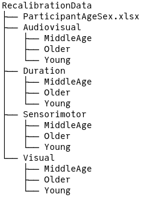
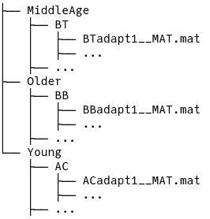

# (APPENDIX) Appendix {-}


# Supplementary Code {#code}

**Eight Schools Model**

```
data {
  int<lower=0> J;         // number of schools 
  real y[J];              // estimated treatment effects
  real<lower=0> sigma[J]; // standard error of effect estimates 
}
parameters {
  real mu;                // population treatment effect
  real<lower=0> tau;      // standard deviation in treatment effects
  vector[J] eta;          // unscaled deviation from mu by school
}
transformed parameters {
  vector[J] theta = mu + tau * eta; // school treatment effects
}
model {
  target += normal_lpdf(eta | 0, 1);       // prior log-density
  target += normal_lpdf(y | theta, sigma); // log-likelihood
}
generated quantities {
  vector[J] log_lik;

  for (j in 1:J) {
    log_lik[j] = normal_lpdf(y[j] | theta[j], sigma[j]);
  }
}
```


# Developing a Model {#model-dev}


[Chapter 4](#application) details the deeper considerations that went into building a model, but doesn't tell the full story of struggles and setbacks I faced. I find that I learn more from others when they share what didn't work along with the final path that did work. There is knowledge to be gained in failed experiments, because then there is one more way to not do something, just like a failing outcome reduces the variance of the Beta distribution.


I knew that I wanted to apply Bayesian modeling techniques to the data, because it was something knew that I was learning. I tried using a classical GLM to first get a baseline understanding of the data, but the fact that some estimates for certain subjects failed due to complete separation reinforced my enthusiasm to employ non-classical techniques. My first Bayesian model was derived from @lee2014bayesian which used nested loops to iterate over subjects and SOA values. I felt that the data was stored in a complicated way and made it difficult to comprehend and extend.


Next I moved on to using `arm::bayesglm` to remove convergence issues, but was met with other limitations such as linear parameterization and lack of hierarchical modeling. The book Statistical Rethinking [@mcelreath2020statistical] was my first introduction to Bayesian multilevel modeling. His `rethinking` package accompanies the book, and offers a compact yet expressive syntax for models that get translated into a Stan model. A model with age group and block can be written using `rethinking::ulam` as


```{r ch220-Rubber Modern, echo=TRUE, eval=FALSE}
rethinking::ulam(alist(
  k ~ binomial_logit(n, p),
  p = exp(b + bG[G] + bT[trt]) * (x - (a + aG[G] + aT[trt])),
  a ~ normal(0, 0.06),
  aG[G] ~ normal(0, sd_aG),
  aT[trt] ~ normal(0, sd_aT),
  b ~ normal(3, 1),
  bG[G] ~ normal(0, sd_bG),
  bT[trt] ~ normal(0, sd_bT),
  c(sd_aG, sd_aT, sd_bG, sd_bT) ~ half_cauchy(0, 5)
), data = df, chains = 4, cores = 4, log_lik = TRUE)
```


During my time learning about multilevel models, I tried writing my own package that generates a Stan program based on R formula syntax. At the time I didn't fully understand the concepts of no-pooling, complete pooling, and partial pooling, and my package was plagued by the same lack of flexibility that `rstanarm` and `brms` have. In fact I learned that `brms` and `rstanarm` already did what I was trying to do after I had already started making my library, but it was a fun learning and programming experience. The fossilized remains of my attempt can be viewed on github.


I also tried using `lme4`, `rstanarm`, and `brms`, and learned more about the concepts of fixed and random effects. It was around this time that I noticed that parameterization can have a significant affect on the efficiency of a model and the inferential power of the estimated parameters. When fitting a classical model, there is little difference in estimating `a + bx` vs. `d(x - c)` since the latter can just be expanded as `-cd + dx` which is essentially the same as the first parameterization, but there is a practical difference in the interpretation of the parameters. The second parameterization implies that there is a dependence among the parameters that can be factored out. In the context of psychometric functions, there is a stronger connection between PSS and `c` and the JND and `d`. This parameterization made it easier to specify priors and also increased the model efficiency. Since only `rethinking` and `Stan` allow for arbitrary parameterization, I left the others behind.


I finally arrived at a model that worked well, but learned that using a binary indicator variable for the treatment comes with the assumption of higher uncertainty for one of the conditions. The linear model that I arrived at is displayed in equation \@ref(eq:badlinearmodel).


\begin{equation}
  \theta = \exp(\beta + \beta_G +(\beta_T + \beta_{TG})\times trt) \left[x - (\alpha + \alpha_G + (\alpha_T + \alpha_{TG})\times trt)\right]
  (\#eq:badlinearmodel)
\end{equation}


Using an indicator variable in this fashion also introduced an interaction effect into the model that I almost did not account for after I switched to using a factor variable. Interaction effects between factors is handled by creating a new factor that is essentially the cross-product of other factor variables. E.g. for factor variables $x$ and $y$


$$
x = \begin{bmatrix}
a \\
b \\
c
\end{bmatrix}, y =  \begin{bmatrix}
i \\
j
\end{bmatrix}\Longrightarrow x\times y = 
\begin{bmatrix}
ai & aj \\
bi & bj \\
ci & cj
\end{bmatrix}
$$


The final round of reparameterization came in the form of adopting non-centered parameterization for more efficient models. To us, $Z \sim N(0, 1^2);\quad X = 3 + 2Z$ is the same as $X \sim N(3, 2^2)$, but to a computer the process of sampling from $X$ can be more difficult than sampling from $Z$ (discussed in [chapter 4](#model-checking)).


# Reproducible Results {#reproduce}


```{r ch230-setup, include=FALSE}
library(tidyverse)
fp <- list.files(path = "data/RecalibrationData/",
                 recursive = TRUE,
                 pattern = "(.mat)$")
fp_typ_reg <-
  "^(\\w+)/(\\w+)/(\\w+)/[A-Z]{2,3}_*[A-Z]*(adapt[0-9]|baseline[0-9]*).*"
fp_typ_logi <- str_detect(fp, fp_typ_reg)
fp_typ <- fp[fp_typ_logi]
fp_atyp <- fp[!fp_typ_logi]
get_feat_typ <- function(mat) {
  expr <-
    "^(\\w+)/(\\w+)/(\\w+)/[A-Z]{2,3}_*[A-Z]*(adapt[0-9]|baseline[0-9]*).*"
  str_replace(mat, expr, replacement = "\\1 \\2 \\3 \\4") %>%
    str_split(pattern = " ", simplify = TRUE) %>% c()
}
get_feat_atyp <- function(mat) {
  expr <-
    "^(\\w+)/(\\w+)/(\\w+)/[A-Zb-z]{2,3}_{0,1}[0-9]*_{0,1}(\\S*)__MAT.mat"
  str_replace(mat, expr, "\\1 \\2 \\3 \\4") %>%
    str_split(" ", simplify = TRUE) %>% c()
}
feat_typ  <- map(fp_typ,  get_feat_typ)  %>% do.call(what = rbind)
feat_atyp <- map(fp_atyp, get_feat_atyp) %>% do.call(what = rbind)
cn <- c("task", "age_group", "initials", "trial")
colnames(feat_typ)  <- cn
colnames(feat_atyp) <- cn
feat_typ <- as_tibble(feat_typ) %>%
  add_column(path = fp_typ, .before = 1) %>%
  mutate(trial = if_else(str_detect(trial, "baseline"), "baseline", trial))
feat_atyp <- as_tibble(feat_atyp) %>%
  add_column(path = fp_atyp, .before = 1) %>%
  mutate(trial = if_else(trial == "", "baseline", trial)) %>%
  mutate(trial = str_replace(trial, "([A-Za-z]+)_*([0-9])+", "adapt\\2")) %>%
  mutate(trial = if_else(str_detect(trial, "adapt"), trial, "baseline"))
feature_tbl <- bind_rows(feat_typ, feat_atyp) %>%
  mutate(
    task = tolower(task),
    age_group = factor(age_group),
    age_group = recode_factor(
      age_group,
      Young = "young_adult",
      MiddleAge = "middle_age",
      Older = "older_adult",
    ),
    age_group = as.character(age_group)
  )
age_sex_tbl <- readxl::read_xlsx(
  "data/RecalibrationData/ParticipantAgeSex.xlsx",
  col_types = c("guess", "numeric", "guess")
) %>%
  mutate_at(vars(Sex), as.factor) %>%
  rename(initials = ID,
         age = Age,
         sex = Sex) %>%
  arrange(initials)
get_age_group <- function(age) {
  age_group <- vector("character", length(age))
  age_group[age >= 18 & age <= 30] <- "young_adult"
  age_group[age >= 39 & age <= 50] <- "middle_age"
  age_group[age >= 65 & age <= 75] <- "older_adult"
  age_group[age_group == ""] = NA
  age_group
}
feature_tbl <- feature_tbl %>%
  unite(col = "initials_age_group",
        initials,
        age_group,
        sep = "-",
        remove = TRUE)
age_sex_tbl <- age_sex_tbl %>%
  mutate(age_group = get_age_group(age)) %>%
  unite(col = "initials_age_group",
        initials,
        age_group,
        sep = "-",
        remove = TRUE)
feature_tbl <-
  full_join(feature_tbl, age_sex_tbl, by = "initials_age_group") %>%
  separate(initials_age_group, c("initials", "age_group"), sep = "-") %>%
  mutate(age_group = factor(
    age_group,
    levels = c("young_adult", "middle_age", "older_adult"),
    ordered = FALSE
  )) %>%
  mutate(trial = factor(
    trial,
    levels = c("baseline", "adapt1", "adapt2", "adapt3"),
    ordered = FALSE
  ))
features <- feature_tbl %>%
  mutate(
    tmp_task = recode_factor(
      task,
      audiovisual = "av",
      visual = "vis",
      sensorimotor = "sm",
      duration = "dur"
    ),
    trial = recode_factor(
      trial,
      baseline = "pre",
      adapt1 = "post1",
      adapt2 = "post2",
      adapt3 = "post3"
    ),
    initials = str_replace(initials, "JM_F", "JM"),
    tmp_sex = tolower(as.character(sex)),
    tmp_age_group = recode_factor(
      age_group,
      young_adult = "Y",
      middle_age = "M",
      older_adult = "O"
    )
  ) %>%
  unite(
    rid,
    tmp_task,
    trial,
    tmp_age_group,
    tmp_sex,
    initials,
    sep = "-",
    remove = FALSE
  ) %>%
  unite(sid,
        tmp_age_group,
        tmp_sex,
        initials,
        sep = "-",
        remove = FALSE) %>%
  select(-c(tmp_task, tmp_sex, tmp_age_group, initials)) %>%
  select(rid, sid, path, task, trial, age_group, age, sex) %>%
  arrange(rid) %>%
  mutate(rid = factor(rid),
         sid = factor(sid))
```


Data doesn't always come in a nice tidy^[Tidy data is described by Hadley Wickham] format, and I had the pleasure of turning the raw experimental data into a clean data set that is ready for modeling. Sometimes the process is quick and straight forward, but other times, like with this psychometric data, it takes more effort and clever techniques. There is academic value in describing the steps I took up front to reduce the headache later.


To begin, there is a strong push in recent years for reproducible data science. Scientific methods and results should be able to be replicated by other researchers, and part of that includes being able to replicate the process that takes the raw data and produces the tidy data that is ready for analysis. Tidy data is described by @wickham2014tidy and can be summed up by three principles


1. Each variable forms a column
2. Each observation forms a row
3. Each type of observational unit forms a table


One problem I have come across and have been guilty of in the past is having data in a spread sheet, modifying it, and then having no way of recovering the original data. Spread sheets are a convenient way to organize, transform, and lightly analyze date, but problems can quickly arise unless there is a good backup/snapshot system in place. Data is immutable^[Mutability in computer science is the property of a data structure where its contents can be modified in place. Immutability means that the object cannot be modified without first making a copy.], or at least that is the mindset that researchers must adopt in order to have truly reproducible workflows. The raw data that is collected or produced by a measurement device should never be modified without first being copied, even if for trivial reasons such as correcting a spelling mistake^[If a change is made to the raw data, it should be carefully documented and reversible].


To begin the data cleaning journey, I'll introduce the directory system that I had been given to work with. Each task is separated into its own folder, and within each folder is a subdirectory of age groups.


```{r ch230-Lama Everyday, out.width="30%"}

```


Within each age group subdirectory are the subdirectories for each subject named by their initials which then contain the experimental data in Matlab files.


```{r ch230-Third Needless Antique, out.width="35%"}

```


At this point, the data appears manageable, there is information contained in the directory structure such as task, age group, and initials, and file name contains information about the experimental block. There is also an excel file that I was later given that contains more subject information like age and sex, though that information is not used in the model. The columns of the Matlab file depends on the task, but generally contains an SOA value and a response, but no column or row name information - that was provided by the researcher who collected the data. 


The next thing I did was to create a table of metadata - information extracted from the directory structure and file names combined with the the subject data and the file path. Regular expressions can be used to extract patterns from a string. With a list of all Matlab files within the `RecalibrationData` folder, I tried to extract the task, age group, initials, and block using the expression


```
"^(\\w+)/(\\w+)/(\\w+)/[A-Z]{2,3}_*[A-Z]*(adapt[0-9]|baseline[0-9]*).*"
```


Breaking it apart, the `^(\\w+)/` matches any word characters at the start and before the next slash. Since the directory structure is `Task/AgeGroup/Subject/file.mat`, the regular expression should match three words between slashes. The file name generally follows the pattern of `Initials__block#__MAT.mat`, so `[A-Z]{2,3}_*[A-Z]*` should match the initials, and `(adapt[0-9]|baseline[0-9]*)` should match the block (baseline or adapt). This method works for $536$ of the $580$ individual records. For the ones it failed, it was generally do to misspellings or irregular capitalizing of "baseline" and "adapt".


```{r ch230-Lonesome Helium, echo=TRUE}
table(feat_typ[,4])
```


```{r ch230-Brave Gamma, echo=TRUE}
table(feat_atyp[,4])
```


Since there is only a handful of irregular block names, they can be dealt with a separate regular expression that properly extracts the block information. Other challenges in cleaning the data include the handling of subjects with the same initials. This becomes a problem because filtering by a subject's initials is not guaranteed to return a unique subject. Furthermore there are two middle age subjects with the same initials of "JM", so one was also identified with their sex "JM_F". The solution is to create a unique identifier (labeled as SID) that is a combination of age group, sex, and initials. For an experiment identifier (labeled as RID), the task and block were prepended to the SID. Each of these IDs uniquely identify the subjects and their experimental records making it easier to filter and search.


```{r ch230-Remote Monkey, echo=TRUE}
glimpse(features)
```


Then with the table of clean metadata, the task is simply to loop through each row, read the Matlab file given by `path`, add the unique ID as a column, and then join the experimental data with the metadata to create a data set that is ready for model fitting and data exploration. The full code used to generate the clean data is not yet available online, but can be shared with the committee.


The benefit of writing a script to generate the data is that others can look over my code and verify that it is doing what I intended for it to do, and I can go back to any step within the process to make changes if the need comes up. Another tool that contributed to the reproducibility is the version control management software, Git. With Git I can take a snapshot of the changes I make, and revert if necessary. This thesis is also hosted on Github, and the entire history of development can be viewed there.
