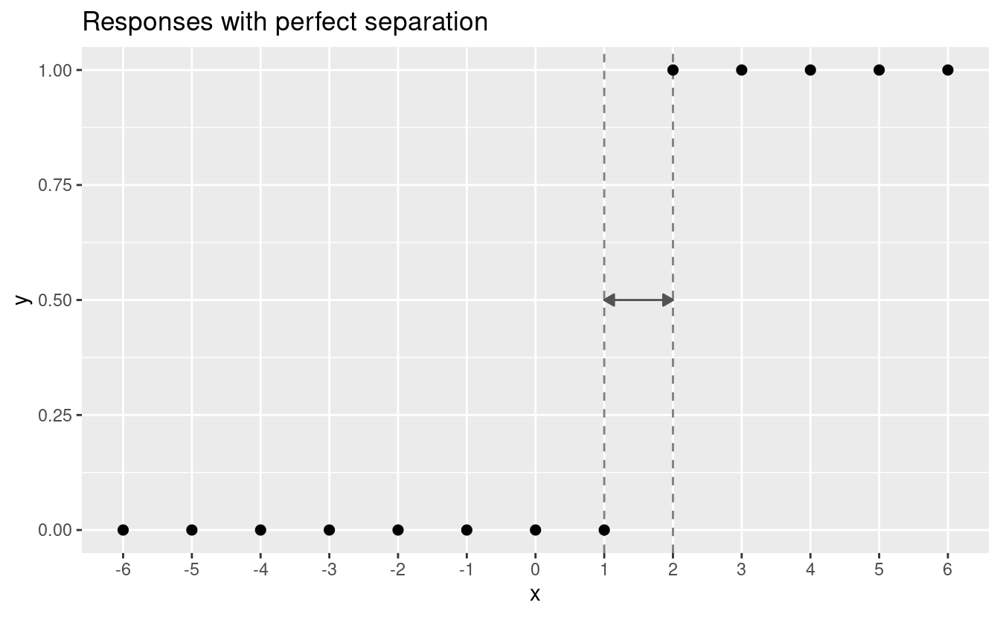

# Modeling the Psychometric Function {#background}

A psychometric function can be fit using a generalized linear model (GLM) with the link function coming from the family of S-shaped curves called a sigmoid. Commonly GLMs are fit using maximum likelihood estimation (MLE). In the case of a psychometric experiment, we can represent the outcome of a single trial as the result of a random experiment arising from a Bernoulli process. Without loss of generality, the psychometric function, $F(x; \theta)$, determines the probability that the outcome is 1.

\begin{align*}
Y &\sim \textrm{Bernoulli}(\pi) \\
\pi &= P(Y=1 \vert x; \theta) = F(x; \theta)
\end{align*}

If $P(Y=1 | x; \theta) = F(x;\theta)$, then $P(Y = 0 | x; \theta) = 1 - F(x;\theta)$, and hence the probability of an outcome is

\begin{equation}
  P(Y=y | x; \theta) = F(x;\theta)^y(1-F(x;\theta))^{1-y}
  (\#eq:bernproby)
\end{equation}

The likelihood function, $\mathcal{L}$, can be determined using equation \@ref(eq:bernproby)

\begin{equation}
  \begin{split}
    \mathcal{L}(\theta | y, x) &= \prod_{i}^{N} P(y_i | x_i; \theta) \\
    &= \prod_{i}^{N}F(x_i;\theta)^{y_i}(1-F(x_i;\theta))^{1-y_i}
  \end{split}
  (\#eq:bernlik)
\end{equation}

Equation \@ref(eq:bernlik) is commonly expressed in terms of its logarithm.

\begin{equation}
  \ln \mathcal{L}(\theta | y, x) = \sum_{i}^{N} y_i \ln\left(F(x_i;\theta)\right) + (1-y_i) \ln\left(F(x_i;\theta))\right)
  (\#eq:bernloglik)
\end{equation}

From here the classical approach would be to take the derivative of \@ref(eq:bernloglik), set it equal to $0$, and solve for $\theta$. Additionally one might perform a second derivative test to ensure that the solution is indeed a maximizer to \@ref(eq:bernloglik) (and hence to  \@ref(eq:bernlik)). However no closed form expression exists for the solution to $\frac{d}{d\theta} \ln \mathcal{L}(\theta) = 0$, and so numerical optimization methods like gradient descent are used to iteratively find the MLE solution. In most cases this works fine, but there are common situations where MLE fails. In this chapter I will discuss common techniques for fitting psychometric functions, the reasons to use these methods, and the conditions for when they are not optimal.

As introduced above, the first method is to use generalized linear models. A GLM is one that can be transformed into a linear model via a link function. An example of this is the logistic function which takes $x \in \mathbb{R}$ and squishes the output to be in $(0, 1)$.

\begin{equation}
  F(\theta) = \frac{1}{1 + \exp\left(-\theta\right)}
  (\#eq:logistic)
\end{equation}

Since $F$ is a strictly increasing and continuous function, it has an inverse, and the link for \@ref(eq:logistic) is the log-odds or logit function.

\begin{equation}
  F^{-1}(\pi) = \mathrm{logit}(\pi) = \ln\left(\frac{\pi}{1 - \pi}\right)
  (\#eq:logit)
\end{equation}

By taking $(F^{-1} \circ F)(\theta)$ we can arrive at a relationship that is linear in $\theta$.

\begin{align*}
  \pi = F(\theta) \Longleftrightarrow F^{-1}(\pi) &= F^{-1}(F(\theta)) \\
  & = \ln\left(\frac{F(\theta)}{1 - F(\theta)}\right) \\
  &= \ln(F(\theta)) - \ln(1 - F(\theta)) \\
  &= \ln\left(\frac{1}{1 + \exp(-\theta)}\right) - \ln\left(\frac{\exp(-\theta)}{1 + \exp(-\theta)}\right) \\
  &= - \ln(1 + \exp(-\theta)) - \ln(\exp(-\theta)) + \ln(1 + \exp(-\theta)) \\
  &= - \ln(\exp(-\theta)) \\
  &= \theta
\end{align*}

Linear models are favored in statistics because they are generally easier to interpret than other types of models. For example, say $\mathrm{logit}(\pi) = 0.5 + 1.5x$ where $\pi$ is the probability of a positive outcome, $Y=1$. We can say that at $x = 0$, the log-odds of a positive outcome is 0.5, and an increase in $x$ by 1 increases the log-odds by 1.5.

There is nothing that is particular about the logistic function that makes it the only suitable sigmoid for psychometric functions. Other common link functions include the probit (inverse of the standard normal CDF) and Weibull inverse CDF. In fact, any continuous CDF defined on the real number line can be used for psychometric functions. A PF only requires that a function is strictly increasing and bounded between 0 and 1.The logit and probit links have properties such as connections to log-odds and the normal distribution that make working with them more convenient.

## Methods for working with PFs

- Generalized Linear Models
  - classical approaches to fitting/estimation
    - Maximum likelihood estimation
      - Simple and almost every piece of statistical software will have an implementation
  - Expectation Maximization
  - Random effects (Gelmen and Hill)
  - Bayesian GLMs
    - Completely reliant on MCMC

Above we introduced GLMs as a method for estimating the properties of psychometric functions. GLMs are abundant in statistical analyses, and almost every piece of statistical software will have an implementation for working with them - most commonly through maximum likelihood estimation. MLE is not the only method; there is also the expectation-maximization (EM) algorithm and Bayesian GLMs.

<!-- How much do I need to know about EM algorithm? -->

<!-- How much do I need to know about Bayesian GLMs? -->

Bayesian methods for fitting psychometric function are also common

- Bayesian logistic regression
  - @gelman2008weakly
  - Can't completely express the structure (hierarchy) of the data

We can also throw away GLMs entirely and utilize non-parametric techniques for estimating psychometric functions. @zchaluk2009model make the argument that the true model for a PF is rarely (if ever) known, so it is better to make no assumptions about the underlying performance function - a requirement for GLMs. They show that their model-free estimation yields better-if-not-equal results in signal detection than parametric models, but the tradeoff is the loss of inferential power and the ability to generalize predictions to new groups or previously unobserved data.

## Post-model Analysis

- Residual Analysis
  - using the fitted values vs. the observed values to evaluate goodness of fit
- ANOVA
- T-tests

## Shortcomings

Despite the proliferation of maximum likelihood estimation for psychometric functions, there are also common situations where MLE is sub-optimal or not possible. The most common example given is when the data are perfectly separable. Perfect separation is when all the positive responses can be determined by a set of predictors with no contamination (see figure \@ref(fig:ch030-perfect-separation)).

(\#fig:ch030-perfect-separation)The positive responses on the right can be completely separated from the negative responses on the left by any value of x between 1 and 2.

Two problems happen here: 1) the maximum likelihood estimate of the slope is $\infty$ which means that some algorithms will never converge, and 2) the center of the psychometric function is not uniquely defined. Any location value in the range $[1, 2]$ is valid and perfectly separates the positive and negative responses. In psychometric experiments, neither of these results are likely, and neither are informative. The just noticeble *difference* is not zero, and the *point* of subject simultaneity is not a range.

- shortcomings
  - Convergence failure in the presence of complete separation
    - [@prins2019too], [@ghosh2018use]
    - Give an example with how the MLE values are estimated
    - Give an example where MLE fails
    
- problems/limitations of post-model analyses
- problems with thinking that simply using Bayesian techniques solves all problems with classical ones

- So what's the answer?
  - The last two options (bayes + multilevel) when on their own do well, but are not robust to 

## Bayesian Multilevel Modeling {#bayesian-modeling}

- short intro
  - sentence 1
  - sentence 2
  - sentence 3

### Bayesian Stuff

- Mathematical foundations
  - Bayes rule in regression setting
  
- Easy in theory, difficult in practice
  - Example of a conjugate priors
  - need more complexity -> computer methods
  - Computer methods needed
-

### Multilevel Modeling Stuff

- Estimating the variance at different levels in the model
- 

