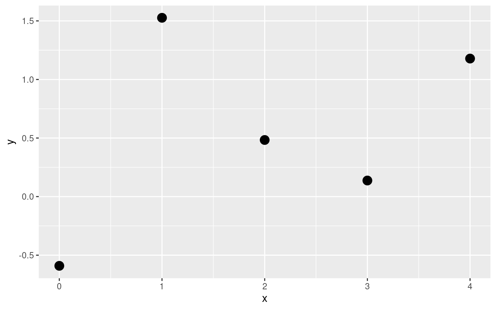
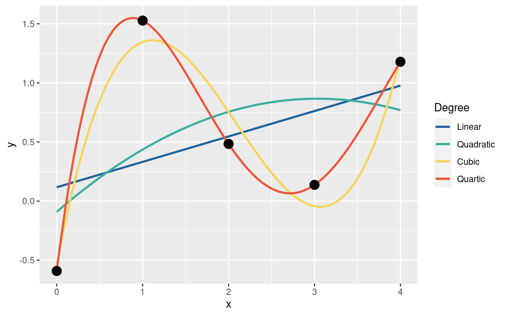
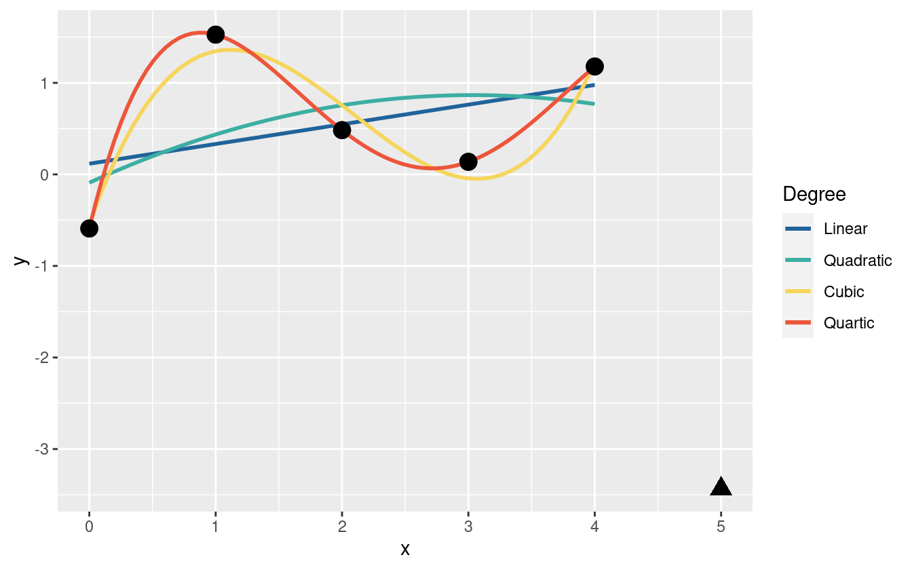
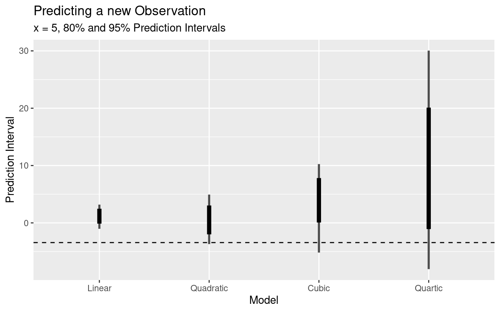

# Predictive Inference {#predictive-inferences}

_All models are wrong, but some are useful_

The above quote is from George Box, and it is a popular quote that statisticians like to throw around^[I am one of them]. All models are wrong because it is nearly impossible to account for the minutiae of every process that contributes to an observed phenomenon, and often trying to results in poorer performing models. Also is it ever truly possible to _prove_ that a model is correct? At best our scientific method can falsify certain hypotheses, but it cannot ever tell us if a model is universally correct. That doesn't matter. What does matter is if the model is useful and can make accurate predictions.

Why is predictive performance so important? Consider five points of data (figure \@ref(fig:ch050-Moving-Moose)). I have simulated values from some polynomial equation of degree less than five, but with no more information other than that, how can the best polynomial model be selected?

<div class="figure" style="text-align: center">

<p class="caption">(\#fig:ch050-Moving-Moose)Five points from a polynomial model.</p>
</div>

One thing to try is fit a handful of linear models, check the parameter's p-values, the $R^2$ statistic, and perform other goodness of fit tests, but there is a problem. As you increase the degree of the polynomial fit, the $R^2$ statistic will always increase. In fact with five data points, a fourth degree polynomial will fit the data perfectly (figure \@ref(fig:ch050-Olive-Screwdriver)).


<div class="figure" style="text-align: center">

<p class="caption">(\#fig:ch050-Olive-Screwdriver)Data points with various polynomial regression lines.</p>
</div>

If I were to add a $6^{th}$ point - a new observation - which of the models would you expect to do best? Can it be estimated which model will predict best before testing with new data? One guess is that the quadratic or cubic model will do well because because the linear model is potentially _underfit_ to the data and the quartic is _overfit_ to the data. Figure \@ref(fig:ch050-Cold-Fish) shows the new data point from the polynomial model. Now the linear and cubic models are trending in the wrong direction. The quadratic and quartic models are both trending down, so may be the correct form for the model.


<div class="figure" style="text-align: center">

<p class="caption">(\#fig:ch050-Cold-Fish)The fitted polynomial models with a new observation.</p>
</div>

Figure \@ref(fig:ch050-Strawberry-Swallow) shows the 80% and 95% prediction intervals for a new observation given $x = 5$ as well as the true outcome as a dashed line at $y = -3.434$. The linear model has the smallest prediction interval (PI), but completely misses the target. The remaining three models all include the observed value in their 95% PIs, but the quadratic has the smallest PI of the three. The actual data generating polynomial is

$$
y \sim \mathcal{N}(\mu, 1^2) \\
\mu = -0.5(x - 2)^2 + 2
$$


<div class="figure" style="text-align: center">

<p class="caption">(\#fig:ch050-Strawberry-Swallow)95% Prediction intervals for the four polynomial models, as well as the true value (dashed line).</p>
</div>

This is just a toy example, and real-world real-data models are often more complex, but they do present the same headaches when it comes to model/feature selection and goodness of fit checks. Clearly the quartic model has the best fit to the data, but it is too variable and doesn't capture the regular features of the data, so it does poorly for the out-of-sample prediction. The linear model suffers as well by being less biased and too inflexible to capture the structure of the data. The quadratic and cubic are in the middle of the road, but the quadratic does well and makes fewer assumptions about the data. In other words, the quadratic model is just complex enough to predict well while making fewer assumptions. _Information criteria_ is a way of weighing the prediction quality of a model against its complexity, and is arguably a better system for model selection/comparison than other goodness of fit statistics such as $R^2$ or p-values.

## Model Comparison via Predictive Performance

We don't always have the observed data to compare predictions against (nor the data generating model). Some techniques to compensate for this limitation include cross validation, where the data is split into _training_ data and _testing_ data. The model is fit to the training data, and then predictions are made with the testing data and compared to the observed values. This can often give a good estimate for out-of-sample prediction error. Cross validation can be extended into k-fold cross validation. The idea is to _fold_ the data into $k$ disjoint partitions, and predict partition $i$ using the rest of the data to train on. The prediction error of the $k$-folds can then be averaged over to get an estimate for out-of-sample prediction error.

Taking $k$-fold CV to the limit by letting $k = \# observations$ results in something called _leave one out cross validation_ (LOOCV), where for each observation in the data, the model is fit to the remaining data and predicted for the left out observation. The downside of $k$-fold cross validation is that it requires fitting the model $k$ times, which can be computationally expensive for complex Bayesian models. Thankfully there is a way to approximate LOOCV without having to refit the model many times.

### LOOCV and Importance Sampling

LOOCV and many other evaluation tools such as WAIC rest on the _log-pointwise-predictive-density_ (lppd), which is a loose measure of deviance from some "true" probability distribution. Typically we don't have the analytic form of the predictive posterior, so instead we use $S$ MCMC draws to approximate the lppd [@vehtari2017practical]:

$$
\begin{equation}
\mathrm{lppd}(y, \Theta) = \sum_i \log \frac{1}{S} \sum_s p(y_i | \Theta_s)
(\#eq:lppd)
\end{equation}
$$

To estimate LOOCV, the relative "importance" of each observation must be computed. Certain observations have more influence on the posterior distribution, and so have more impact on the posterior if they are removed. The intuition behind measuring importance is that more influential observations are relatively less likely than less important observations that are relatively expected. Then by omitting a sample, the relative importance weight can be measured by the lppd. This omitted calculation is known as the out-of-sample lppd. For each omitted $y_i$,

$$
\mathrm{lppd}_{CV} = \sum_i \frac{1}{S} \sum_s \log p(y_{i} | \Theta_{-i,s})
$$


There is a package called `loo` that can compute the expected log-pointwise-posterior-density (ELPD) using PSIS-LOO, as well as the estimated number of effective parameters and LOO information criterion [@R-loo]. For the part of the researcher, the log-likelihood of the observations must be computed in the model. For my models, I added this in the _generated quantities_ block of my Stan program. It is standard practice to name the log-likelihood as `log_lik` in the model.

```
generated quantities {
  vector[N] log_lik;

  for (i in 1:N) {
    real alpha = b + bGT[G[i], trt[i]];
    real beta = a + aGT[G[i], trt[i]];
    real lambda = lG[G[i]];
    real p = lambda + (1 - 2*lambda) * inv_logit(exp(beta) * (x[i] - alpha));
    log_lik[i] = binomial_lpmf(k[i] | n[i], p);
  }
}
```

 Models can be compared simply using `loo::loo_compare`. It estimated the ELPD and its standard error, then calculates the relative differences between all the models. The model with the highest ELPD is predicted to have the best out-of-sample predictions. The comparison of the first three iterations of the model from [chapter 3](#workflow) for the audiovisual data are shown below.


```r
comp_av <- loo_compare(l031_av, l032_av, l032nc_av, l033_av)
print(comp_av, simplify = FALSE)
#>        elpd_diff se_diff elpd_loo se_elpd_loo p_loo   se_p_loo looic   se_looic
#> model4     0.0       0.0 -1615.7     42.8        16.2     0.9   3231.4    85.6 
#> model2    -1.0       3.8 -1616.7     42.6        11.3     0.6   3233.3    85.2 
#> model3    -1.3       3.8 -1617.0     42.7        11.8     0.6   3234.0    85.3 
#> model1   -32.8      10.4 -1648.5     43.0         3.0     0.2   3296.9    86.1
```

The centered and non-centered parameterizations (models 2 and 3 respectively) have essentially the same ELPD. This is expected since they are essentially the same model. The reparameterization only helps with model fitting efficiency, though that can mean more reliable posteriors. The model with age-block interactions (model 4) has the highest ELPD, but is not decisively the best as determined by the standard error of the ELPD. The only thing that can be determined is that including age and block improves performance significantly over the base model (model 1).

But how about for the visual data? The fourth iteration of the model introduced a lapse rate. Did the change significantly improve the ELPD?


```r
comp_vis <- loo_compare(l033_vis, l034_vis)
print(comp_vis, simplify = FALSE)
#>        elpd_diff se_diff elpd_loo se_elpd_loo p_loo   se_p_loo looic   se_looic
#> model2     0.0       0.0 -1001.1     44.0        19.2     1.9   2002.2    88.0 
#> model1  -259.4      31.9 -1260.5     56.1        23.1     2.3   2520.9   112.2
```

Absolutely! Something else interesting also happened with the introduction of the lapse rate - the effective number of parameters decreased (`p_loo`).

Earlier I argued that model selection is out, model comparison is in. At the end of [chapter 3](#workflow) I finished with a model that has age-block interactions and a lapse rate for each age group. There was one more model that I could have specified - one that estimates at the subject level. There is no domain-specific reason to include the subject level information, especially since the goal is to make inferences at the age group level, but there may still be statistical reason to add in the subjects. For one, adding in the subject as another level in a multilevel model can induce regularization among the subjects, which can overall make for better predictions on new data.

I've gone ahead and fit the model with subject-level information, and the comparison between this new model and the one from iteration 4 is shown below.


```r
comp_vis2 <- loo_compare(l034_vis, l034s_vis)
print(comp_vis2, simplify = FALSE)
#>        elpd_diff se_diff elpd_loo se_elpd_loo p_loo   se_p_loo looic   se_looic
#> model2     0.0       0.0  -925.1     38.1        75.6     5.4   1850.3    76.2 
#> model1   -76.0      19.1 -1001.1     44.0        19.2     1.9   2002.2    88.0
```

Including the subject-level information significantly improves the ELPD, and even though there are over 100 parameters in the model (slope and intercept for each of the 45 subjects), the effective number of parameters is much less. Since this new model is capable of making inferences at both the age group level and the subject level, I use it for the result section ([chapter 6](#results)).

One concern comes up when it comes to LOOCV and multilevel models. What does it mean to leave _one_ out? Should one subject be left out? One age group? Just one observation? With more levels in a model, more careful considerations must be taken when it comes to estimating prediction performance.
