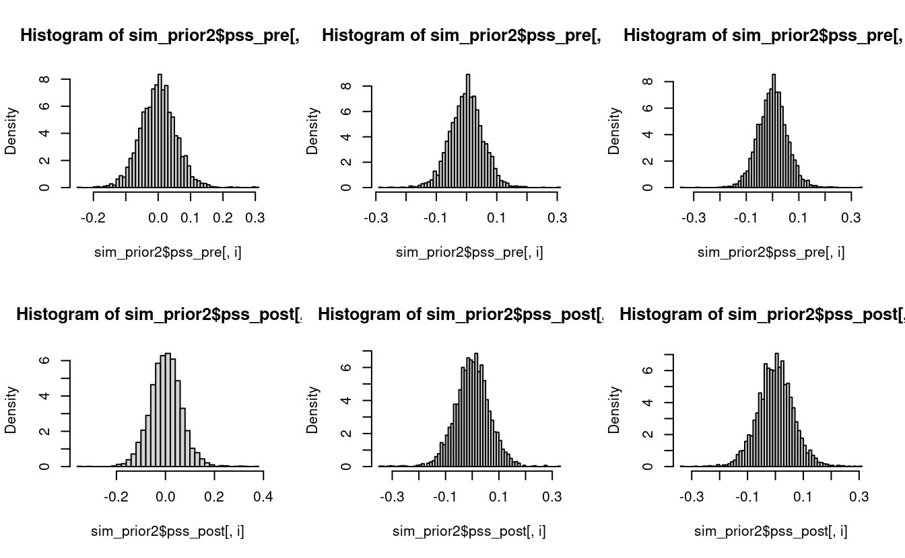
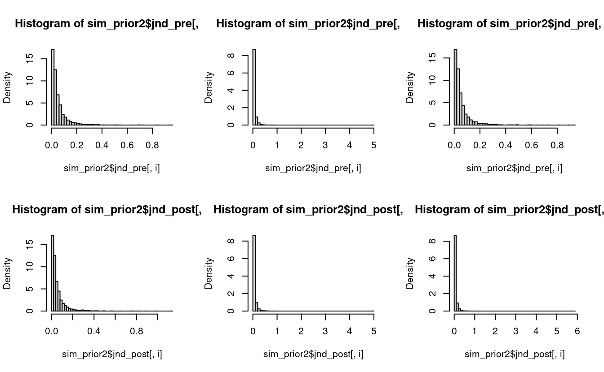
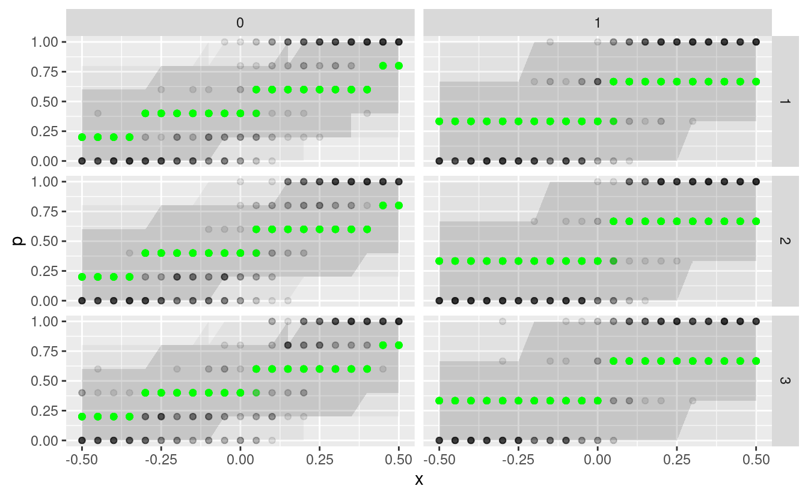

## Iteration 2 (Electric Boogaloo)

### Model Development

In this iteration we will now add in the treatment and age group levels. Instead of modeling the prior distribution of the slope as log-normal, we model it as a normal distribution and then take the exponential. This allows us to also model the age group and treatment slopes as normally distributed and with an additive affect.

$$
\begin{align*}
\beta &\sim \mathcal{N}(3.96, 1.2) \\
\beta_G &\sim \mathcal{N}(0, \sigma_{\beta G}^2) \\
\beta_T &\sim \mathcal{N}(0, 1) \\
\beta_{TG} &\sim \mathcal{N}(0, \sigma_{\beta TG}^2) \\
\gamma &\sim \exp(\beta + \beta_G + (\beta_T + \beta_{TG})\times trt)
\end{align*}
$$

In the above formulation, $\gamma$ is a log-normal random variable with mean-log $3.96$ and variance-log $1.2^2 + \sigma_{\beta G}^2$ if it's the pre-adaptation block, and $1.56^2 + \sigma_{\beta G}^2 + \sigma_{\beta TG}^2$ if it's the post-adaptation block. Values that are negative reduce the slope and increase the JND, and vice versa for positive values.

The intercept term can be specified similarly. Conservatively we choose the prior for the intercepts to be normally distributed with mean 0.

$$
\begin{align*}
\alpha &\sim \mathcal{N}(0, 0.05) \\
\alpha_G &\sim \mathcal{N}(0, \sigma_{\alpha G}^2) \\
\alpha_T &\sim \mathcal{N}(0, 0.05) \\
\alpha_{TG} &\sim \mathcal{N}(0, \sigma_{\alpha TG}^2) \\
\delta &\sim \alpha + \alpha_{G} + (\alpha_{T} + \alpha_{TG}) \times trt
\end{align*}
$$

The parameters and model of the Stan program is

```
parameters {
  real alpha;
  real alpha_G[N_G];
  real alpha_T;
  real alpha_TG[N_G];
  
  real beta;
  real beta_G[N_G];
  real beta_T;
  real beta_TG[N_G];
  
  real<lower=machine_precision()> sigma_aG;
  real<lower=machine_precision()> sigma_aTG;
  real<lower=machine_precision()> sigma_bG;
  real<lower=machine_precision()> sigma_bTG;
}

model {
  alpha ~ normal(0, 0.05);
  alpha_G ~ normal(0, sigma_aG);
  alpha_T ~ normal(0, 0.05);
  alpha_TG ~ normal(0, sigma_aTG);
  
  beta ~ normal(3.96, 1.2);
  beta_G ~ normal(0, sigma_bG);
  beta_T ~ normal(0, 1);
  beta_TG ~ normal(0, sigma_bTG);
  
  sigma_aG ~ cauchy(0, 0.1);
  sigma_aTG ~ cauchy(0, 0.1);
  sigma_bG ~ cauchy(0, 1.0);
  sigma_bTG ~ cauchy(0, 1.0);
  
  vector[N] p;
  for (i in 1:N) {
    real gamma = exp(beta + beta_G[G[i]] + (beta_T + beta_TG[G[i]]) * trt[i]);
    real delta = alpha + alpha_G[G[i]] + (alpha_T + alpha_TG[G[i]]) * trt[i];
    p[i] = gamma * (x[i] - delta);
  }
  k ~ binomial_logit(n, p); // Observational model
}
```


###  Simulate bayesian ensemble


### Prior Checks







```
#>        
#>          [,1]  [,2]  [,3]
#>   50%   0.032 0.031 0.032
#>   95%   0.168 0.169 0.170
#>   99%   0.320 0.307 0.314
#>   99.9% 0.725 0.752 0.689
#>        
#>          [,1]  [,2]  [,3]
#>   50%   0.031 0.031 0.031
#>   95%   0.171 0.180 0.179
#>   99%   0.348 0.351 0.330
#>   99.9% 0.819 0.762 0.780
```

### Configure algorithm

### Fit simulated ensemble


Since we are dealing with the log-normal distribution, we need to be careful and specifiy initial values for sampling.


### Algorithmic calibration


```
#> 
#> Divergences:
#> 
#> Tree depth:
#> 
#> Energy:
```

Additionally we were given the warning that the Bulk ESS is too low, and that running the chains for more iterations can help. So we do just that, and also increase the adapt delta.


```
#>                   mean se_mean     sd       2.5%        25%        50%
#> alpha          -0.0011  0.0006 0.0059    -0.0108    -0.0044    -0.0015
#> alpha_T        -0.0012  0.0002 0.0087    -0.0196    -0.0059    -0.0008
#> sigma_aG        0.0045  0.0002 0.0047     0.0002     0.0014     0.0031
#> sigma_aTG       0.0101  0.0004 0.0107     0.0004     0.0032     0.0075
#> alpha_G[1]     -0.0024  0.0006 0.0056    -0.0230    -0.0038    -0.0008
#> alpha_G[2]     -0.0005  0.0005 0.0052    -0.0199    -0.0017     0.0000
#> alpha_G[3]      0.0012  0.0005 0.0056    -0.0177    -0.0006     0.0006
#> alpha_TG[1]     0.0046  0.0002 0.0093    -0.0098    -0.0004     0.0022
#> alpha_TG[2]     0.0044  0.0002 0.0091    -0.0101    -0.0003     0.0021
#> alpha_TG[3]    -0.0084  0.0003 0.0106    -0.0351    -0.0138    -0.0055
#> beta            2.9663  0.0100 0.1575     2.7770     2.9002     2.9398
#> beta_T         -0.0826  0.0073 0.2174    -0.4787    -0.1594    -0.0891
#> sigma_bG        0.1551  0.0126 0.2873     0.0055     0.0303     0.0655
#> sigma_bTG       0.2594  0.0119 0.4132     0.0085     0.0625     0.1337
#> beta_G[1]      -0.0173  0.0105 0.1556    -0.4123    -0.0274     0.0036
#> beta_G[2]      -0.0294  0.0079 0.1548    -0.4139    -0.0424    -0.0022
#> beta_G[3]      -0.0499  0.0095 0.1593    -0.4453    -0.0627    -0.0134
#> beta_TG[1]     -0.0568  0.0075 0.2212    -0.5900    -0.1113    -0.0293
#> beta_TG[2]      0.0543  0.0074 0.2202    -0.4121    -0.0124     0.0330
#> beta_TG[3]     -0.0324  0.0072 0.2180    -0.5525    -0.0898    -0.0120
#> pss_pre[1]     -0.0035  0.0001 0.0046    -0.0136    -0.0062    -0.0031
#> pss_pre[2]     -0.0016  0.0001 0.0042    -0.0100    -0.0042    -0.0016
#> pss_pre[3]      0.0001  0.0001 0.0047    -0.0083    -0.0032    -0.0001
#> pss_post[1]    -0.0001  0.0001 0.0071    -0.0134    -0.0047    -0.0007
#> pss_post[2]     0.0016  0.0001 0.0068    -0.0107    -0.0029     0.0011
#> pss_post[3]    -0.0095  0.0004 0.0089    -0.0285    -0.0154    -0.0086
#> jnd_pre[1]      0.0870  0.0001 0.0044     0.0778     0.0842     0.0872
#> jnd_pre[2]      0.0880  0.0002 0.0044     0.0798     0.0850     0.0880
#> jnd_pre[3]      0.0899  0.0001 0.0044     0.0817     0.0869     0.0897
#> jnd_post[1]     0.1001  0.0001 0.0070     0.0871     0.0953     0.0998
#> jnd_post[2]     0.0907  0.0002 0.0070     0.0770     0.0860     0.0908
#> jnd_post[3]     0.1009  0.0001 0.0070     0.0879     0.0961     0.1008
#> lp__        -1243.3680  0.2765 5.8057 -1255.0649 -1247.0388 -1243.3967
#>                    75%      97.5%   n_eff  Rhat
#> alpha           0.0014     0.0199   99.31 1.040
#> alpha_T         0.0035     0.0157 3099.45 1.000
#> sigma_aG        0.0059     0.0166  381.76 1.014
#> sigma_aTG       0.0136     0.0361  702.28 1.009
#> alpha_G[1]      0.0004     0.0048  100.55 1.046
#> alpha_G[2]      0.0015     0.0086   97.45 1.037
#> alpha_G[3]      0.0033     0.0128  107.69 1.030
#> alpha_TG[1]     0.0084     0.0279 2404.48 1.004
#> alpha_TG[2]     0.0082     0.0270 2453.88 1.003
#> alpha_TG[3]    -0.0006     0.0047  992.01 1.006
#> beta            2.9860     3.3468  248.36 1.021
#> beta_T         -0.0190     0.4171  888.53 1.006
#> sigma_bG        0.1600     0.7986  515.72 1.010
#> sigma_bTG       0.2885     1.2821 1200.36 1.004
#> beta_G[1]       0.0382     0.1792  218.71 1.023
#> beta_G[2]       0.0267     0.1595  385.89 1.017
#> beta_G[3]       0.0102     0.1383  281.83 1.020
#> beta_TG[1]      0.0158     0.3232  862.37 1.006
#> beta_TG[2]      0.1243     0.5070  884.48 1.005
#> beta_TG[3]      0.0346     0.3628  919.51 1.005
#> pss_pre[1]     -0.0004     0.0048 3334.50 1.001
#> pss_pre[2]      0.0012     0.0066 3394.09 1.002
#> pss_pre[3]      0.0030     0.0103 1484.76 1.005
#> pss_post[1]     0.0043     0.0154 4140.14 1.002
#> pss_post[2]     0.0060     0.0162 2982.42 1.003
#> pss_post[3]    -0.0030     0.0056  612.57 1.010
#> jnd_pre[1]      0.0898     0.0953 3914.60 1.001
#> jnd_pre[2]      0.0909     0.0971  830.30 1.003
#> jnd_pre[3]      0.0926     0.0993 2043.18 1.002
#> jnd_post[1]     0.1047     0.1150 5881.39 1.001
#> jnd_post[2]     0.0957     0.1046 1211.42 1.004
#> jnd_post[3]     0.1054     0.1156 6596.14 1.000
#> lp__        -1239.5208 -1231.3856  440.90 1.007
```

### Inferential Calibration

### Fit Observation


### Diagnose posterior fit

### Posterior retrodictive checks


```
#> # A tibble: 1,827 x 13
#>    `1.5%` `5.5%` `50%` `94.5%` `98.5%` post_mean   N_G     x     k     n     G
#>     <dbl>  <dbl> <dbl>   <dbl>   <dbl>     <dbl> <int> <dbl> <int> <int> <int>
#>  1      0  0     0.333   0.667       1     0.240     3 -0.5      0     3     2
#>  2      0  0     0.333   0.667       1     0.263     3 -0.45     0     3     2
#>  3      0  0     0.333   0.667       1     0.287     3 -0.4      0     3     2
#>  4      0  0     0.333   0.667       1     0.305     3 -0.35     0     3     2
#>  5      0  0     0.333   0.667       1     0.328     3 -0.3      0     3     2
#>  6      0  0     0.333   0.667       1     0.357     3 -0.25     0     3     2
#>  7      0  0     0.333   0.667       1     0.377     3 -0.2      0     3     2
#>  8      0  0     0.333   1           1     0.401     3 -0.15     0     3     2
#>  9      0  0     0.333   1           1     0.422     3 -0.1      0     3     2
#> 10      0  0     0.333   1           1     0.455     3 -0.05     0     3     2
#> 11      0  0     0.333   1           1     0.478     3  0        1     3     2
#> 12      0  0     0.667   1           1     0.506     3  0.05     0     3     2
#> 13      0  0     0.667   1           1     0.523     3  0.1      2     3     2
#> 14      0  0     0.667   1           1     0.553     3  0.15     3     3     2
#> 15      0  0     0.667   1           1     0.585     3  0.2      3     3     2
#> 16      0  0     0.667   1           1     0.608     3  0.25     3     3     2
#> 17      0  0.333 0.667   1           1     0.630     3  0.3      3     3     2
#> 18      0  0.333 0.667   1           1     0.656     3  0.35     3     3     2
#> 19      0  0.333 0.667   1           1     0.679     3  0.4      3     3     2
#> 20      0  0.333 0.667   1           1     0.699     3  0.45     3     3     2
#> 21      0  0.333 0.667   1           1     0.717     3  0.5      3     3     2
#> # … with 1,806 more rows, and 2 more variables: trt <int>, p <dbl>
```



