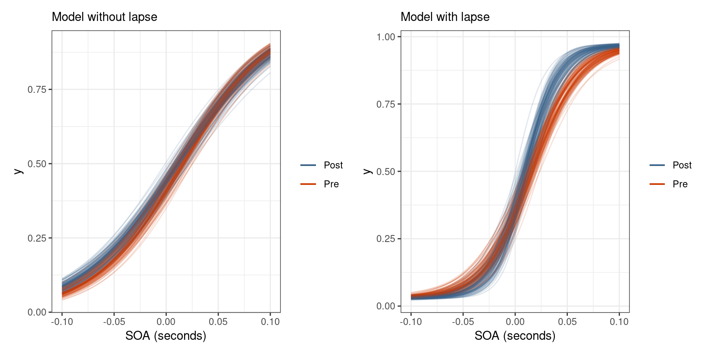

```{r setup, include=FALSE}
fig_height <- 4.5
fig_width  <- 9.0
fig_dpi    <- 192
save_ggplot <- function(plot, name) {
  ggplot2::ggsave(filename = paste0(name, ".png"),
                  plot = plot,
                  device = "png",
                  path = "../figures/",
                  width = fig_width,
                  height = fig_height,
                  dpi = fig_dpi)
}

knitr::opts_chunk$set(echo = FALSE,
                      fig.height = fig_height,
                      fig.width = fig_width,
                      fig.align = "center",
                      comment = "#>",
                      warning = FALSE,
                      message = FALSE,
                      cache = TRUE)

library(tidyverse)
library(patchwork)
library(FangPsychometric)

logit <- function(p) qlogis(p)
inv_logit <- function(x) plogis(x)
logistic <- function(x) inv_logit(x)
fn <- function(x, a, b) logistic(b * (x - a))
Q <- function(p, a, b) qlogis(p) / b + a
Q2 <- function(p, a, b, l) {
  logit((p - l) / (1 - 2*l)) / exp(b) + a
}
```


## Introduction


- Began my Masters by taking _Intro to Statistical Computing_ with Dr. Schissler
- Asked if there were any projects that I could become involved with
- Had the opportunity to work with psychometric data provided by Dr. Fang
- Initially started as a data cleaning project that turned into modeling and analysis
- While cleaning the data, I had to learn the details of the experimental setup and the deeper theory


<div class="notes">
Intro to Stat Comp - learned about R, statistical modeling, and simulation
</div>


## What are psychometrics?


- Psychometric experiments allow us to examine the response between the world around us and our inward perceptions
- Biological and contextual factors influence the integration/segregation of multisensory signals
- A psychometric function relates an observer’s performance to an independent variable
- When the temporal delay between stimuli grows large enough, the brain segregates the two signals and the temporal order can be determined


<div class="notes">
</div>


## Some more background


- The range of temporal delays for which sensory signals are integrated into a global percept is called the temporal binding window
- Perceptual synchrony is the temporal delay between two signals at which an observer is unsure about their temporal order
- The ability to discriminate the timing of multiple sensory signals is referred to as temporal sensitivity
- A deficit in temporal sensitivity may lead to a widening of the temporal binding window


<div class="notes">
Really emphasize the temporal binding window, and the two properties describing it
</div>


## Temporal order judgment tasks {.smaller}

- 
- **Audiovisual** task asks observers if they perceived an audio stimulus before a visual
- **Visual** task asks observers if the right visual stimulus came before the left
- **Duration** task asks observers if lower a circle on a screen was presented longer than an upper circle
- **Sensorimotor** task asks observers if a visual stimulus on a screen came before they pressed a button


```{r multitask-table}
set.seed(4)
multitask %>%
  filter(trial %in% c("pre", "post1")) %>%
  select(-rid) %>%
  group_by(task) %>%
  slice_sample(n = 1) %>%
    ungroup() %>%
  knitr::kable()
```


<div class="notes">
A temporal order judgment task is a type of psychometric experiment where participants are asked to determine the temporal order of two stimuli separated by a temporal delay.

There are four different TOJ tasks within this study that explore the relationship between different sensory signals.
</div>


## Legend for recorded data


```{r ground-truth}
tibble(
  Task = c("Audiovisual", "Visual", "Sensorimotor", "Duration"),
  `Positive Response` = c("Perceived audio first", 
                          "Perceived right first", 
                          "Perceived visual first",
                          "Perceived bottom as longer"),
  `Positive SOA Truth` = c("Audio came before visual",
                           "Right came before left",
                           "Visual came before tactile",
                           "Bottom lasted longer than top")
) %>%
  knitr::kable()
```


<div class="notes">
</div>


## Temporal recalibration


- After completing the first block of the experiment, participants go through an adaptation period
- Participants are repeatedly presented with the task's stimuli at a fixed temporal order and delay
- Temporal recalibration has the possibility of modifying the temporal binding window


<div class="notes">
</div>


## What kind of questions are you trying to answer?


- Does temporal recalibration affect the temporal binding window?
- Does age have an affect on the temporal binding window?

- The temporal binding window is described by two measures
  - **Point of subjective simultaneity** (PSS) which is a proxy for perceptual synchrony
  - **Just noticeable difference** (JND) which is the smallest lapse in time so that a temporal order can just be determined


<div class="notes">
</div>


## The psychometric function {.smaller}


```{r chart-of-pf}
ggplot(tibble(x = c(-4, 4), y = c(0, 1)), aes(x, y)) +
  geom_hline(yintercept = 0, lwd = 0.5) +
  geom_vline(xintercept = 0, lwd = 0.5) +
  stat_function(fun = plogis, args = list(location = 1), size = 1.5, 
                color = "steelblue") +
  geom_segment(aes(x = 0, xend = qlogis(0.5, 1), y = 0.5, yend = 0.5),
               lty = "dotted") +
  geom_segment(aes(x = qlogis(0.5, 1), xend = qlogis(0.5, 1), y = 0, yend = 0.5),
               lty = "dotted") +
  geom_segment(aes(x = 0, xend = qlogis(0.84, 1), y = 0.84, yend = 0.84),
               lty = "dotted") +
  geom_segment(aes(x = qlogis(0.84, 1), xend = qlogis(0.84, 1), y = 0, yend = 0.84),
               lty = "dotted") +
  annotate("segment", x = qlogis(0.5, 1), xend = qlogis(0.84, 1), 
           y = 0.25, yend = 0.25, size = 0.5, color = "gray32",
           arrow = arrow(ends = "both", type = "closed")) +
  annotate("label", x = mean(qlogis(c(0.5, 0.84), 1)), y = 0.25, 
           label = "JND") +
  annotate("segment", 
           x = -1, xend = qlogis(0.5, 1),
           y = 0.84, yend = 0.5, color = "gray32",
           arrow = arrow(type = "closed")) +
  annotate("label", x = -1, y = 0.84, label = "PSS", hjust = 1, vjust = 0) +
  annotate("segment", x = -2, xend = -1.5, 
           y = 0.25, yend = plogis(-1.5, 1), color = "gray32",
           arrow = arrow(type = "closed")) +
  annotate("label", x = -2, y = 0.25, label = "F(x)", vjust = 0, hjust = 1) +
  scale_y_continuous(breaks = c(0, 0.5, 0.84, 1.0)) +
  theme(axis.ticks.x = element_blank(), axis.text.x = element_blank()) +
  labs(x = "Stimulus Onset Asynchrony", y = "Response Probability",
       title = "Components of the Psychometric Function") +
  theme_bw()
```


$$
\begin{align*}
\textrm{PSS} &= \textit{point of subjective simultaneity} \\
\textrm{JND} &= \textit{just noticable difference}
\end{align*}
$$

<div class="notes">
We can answer these questions through the psychometric function. 

The horizontal axis represents the stimulus onset asynchrony (temporal delay), and the vertical axis is the probability of a "positive" response. 

The point of subjective simultaneity is the temporal delay at which the subject is doing no better than random guessing (the 50% level). 

The just noticeable difference is the extra temporal delay needed to just be able to determine temporal order. 

Historically this is defined as the 84% level (one standard deviation away from the mean in a Gaussian distribution).
</div>


## Three ways to visualize the observed data {.smaller}


```{r three-plots-same-data, fig.height=3.75}
p1 <- visual %>%
  filter(trial == "pre") %>%
  ggplot(aes(soa, response)) +
  geom_point(size = 4) +
  theme(axis.title.y = element_blank(),
        axis.title.x = element_blank()) +
  theme_bw()

p2 <- visual %>%
  filter(trial == "pre") %>%
  ggplot(aes(soa, response)) +
  geom_point(size = 4, alpha = 0.05) +
  theme(axis.title.y = element_blank(),
        axis.title.x = element_blank()) +
  theme_bw()

p3 <- visual_binomial %>%
  filter(trial == "pre") %>%
  mutate(p = k / n) %>%
  ggplot(aes(soa, p)) +
  geom_point(size = 4, alpha = 0.05) +
  theme(axis.title.y = element_blank(),
        axis.title.x = element_blank()) +
  theme_bw() +
  labs(y = "response proportion")

(p1 | p2 | p3) + plot_annotation(title = "Three plots, same data",
                                 subtitle = "Visual Task - Pre adaptation")
```


- Transparency better shows the density of "positive" responses at different temporal delays
- Can aggregate repeated measures for temporal delays into Binomial counts
- Proportion can be derived from aggregated Binomial counts


<div class="notes">
</div>


## Data quirks {.smaller}


```{r data-quirks, fig.height=3.5}
pl <- audiovisual_binomial %>%
  filter(rid == "av-post1-O-f-CE") %>%
  mutate(p = k / n) %>%
  ggplot(aes(soa, p)) +
  geom_point(size = 2, alpha = 0.9) + 
  labs(title = "Proportion of responses vs. Temporal delay",
       subtitle = "Record ID av-post1-O-f-CE",
       x = "stimulus onset asynchrony (ms)",
       y = "response proportion") +
  scale_y_continuous(limits = c(0, 1)) +
  theme_bw()

pr <- visual_binomial %>%
  filter(rid == "vis-pre-Y-m-CB") %>%
  mutate(p = k / n) %>%
  ggplot(aes(soa, p)) +
  geom_point(size = 2, alpha = 0.9) + 
  labs(title = "Proportion of responses vs. Temporal delay",
       subtitle = "Record ID vis-pre-Y-m-CB",
       x = "stimulus onset asynchrony (ms)",
       y = "response proportion") +
  scale_y_continuous(limits = c(0, 1)) +
  theme_bw()

pl | pr
```


- (Left) record for `av-post1-O-f-CE` removed from data set
- (Right) some subjects in the visual task have exceptional performance (approaching perfect separation)


<div class="notes">
</div>


# Modeling the Psychometric Function


## Why not use a simple GLM? {.smaller}


```{r fit-glm, echo=TRUE}
glm_subject_level <- glm(response ~ 0 + sid + sid:soa,
  family = binomial("logit"), data = visual,
  subset = trial %in% c("pre", "post1"))
```


```{r glm-estimates}
high_std_err = c("Y-m-CB", "M-m-BT")
broom::tidy(glm_subject_level) %>% 
  filter(str_detect(term, paste(high_std_err, collapse="|"))) %>%
  separate(term, into = c("sid", "soa"), sep = "\\:") %>%
  mutate(soa = if_else(is.na(soa), "(Intercept)", "soa"),
         sid = str_remove(sid, "sid")) %>%
  select(sid, soa, estimate) %>%
  pivot_wider(id_cols = sid, names_from = "soa", values_from = estimate) %>%
  mutate(`pss (ms)` = -`(Intercept)` / soa,
         `jnd (ms)` = qlogis(0.84) / soa) %>%
  knitr::kable(digits = 3)
```


<br />


- Easy to use and fit in `R`
- Necessary to drop one of the categorical levels
- Estimating confidence intervals for psychometric properties requires bootstrap methods
- Near perfect separation results in unreliably large standard errors


<div class="notes">
</div>


## Mixed effects models {.smaller}


```{r fit-glmer, echo=TRUE}
library(lme4) # linear mixed effects
glmer_subject_level <- glmer(
  response ~ 1 + soa + (1 + soa | sid),
  family = binomial("logit"), data = visual,
  subset = trial %in% c("pre", "post1"))
```


```{r glmer-estimates}
coef(glmer_subject_level)$sid %>% as_tibble(rownames = "sid") %>%
  filter(sid %in% high_std_err) %>%
  mutate(`pss (ms)` = -`(Intercept)` / soa,
         `jnd (ms)` = qlogis(0.84) / soa) %>%
  knitr::kable(digits = 3)
```


<br />


- Can model the fixed effects shared across all groups and the group (random) effects
- Levels with less information are shrunk towards the fixed parameter estimate
- More "reasonable" estimates of the just noticeable difference
- Cannot incorporate prior information
- Not flexible enough to model more complex psychometric features like lapse rates


<div class="notes">
</div>


## Enter Bayesian statistics


$$
\pi(\theta | data) = \frac{\pi(data | \theta) \pi(\theta)}{\int_\Omega \pi(data | \theta) \pi(\theta) d\theta}
$$


- Bayes' Theorem is a simple rearranging of conditional probability
  - $P(A|B) = P(A \cap B) / P(B) = P(B|A) \cdot P(A)/P(B)$
- The prior $\pi(\theta)$ is some distribution over the parameter space
- The likelihood $\pi(data | \theta)$ is the probability of an outcome in the sample space given a value in the parameter space
- The denominator is the average likelihood of the data over the parameter space
- The posterior $\pi(\theta | data)$ is our updated belief of the distribution of the parameter


<div class="notes">
</div>


## Easy in theory, difficult in practice


$$
\pi(\theta | data) = \frac{\pi(data | \theta) \pi(\theta)}{\int_\Omega \pi(data | \theta) \pi(\theta) d\theta}
$$


- Often the integral in the denominator is complex or of a high dimension
- The denominator is a constant scale factor that ensures $\pi(\theta|data)$ is a proper probability distribution
  - We often say that the posterior is proportional to the prior times the likelihood: $\quad \pi(\theta | data) \propto \pi(\theta) \times \pi(data | \theta)$
- A solution is to use **Markov Chain Monte Carlo** (MCMC) simulations to draw samples directly from the posterior distribution


<div class="notes">
</div>


## Hamiltonian Monte Carlo


- Markov Chain Monte Carlo constructs a sequence of proposal points from a target distribution
  - Points are accepted or rejected based off of some criterion
- **Hamiltonian Monte Carlo** (HMC) tracks the position of a "particle" following frictionless Hamiltonian dynamics
  - The particle is imparted with a random direction and kinetic energy
  - Effective sampling of high-dimensional probability spaces
  - Has greatly reduced pointwise autocorrelation compared to simpler MCMC
  - Requires evaluating the gradient at each step


[Click me for a demo](http://chi-feng.github.io/mcmc-demo/app.html?algorithm=HamiltonianMC&target=donut)


<div class="notes">
</div>


## Say hello to Stan


- `Stan` is a state-of-the-art platform for statistical modeling
- Gives full Bayesian statistical inference with MCMC sampling
- Utilizes no-U-turn-sampling (NUTS) variant of Hamiltonian Monte Carlo
- Has interfaces to popular programming languages such as `R`, `Python`, and `Julia`
- Provides differentiable probability functions and linear algebra


<div class="notes">
</div>


## 


# Building a Model for the Psychometric Function | Using a Principled Bayesian Workflow


<div class="notes">
</div>


## What is a Principled Bayesian Workflow?


- A method of employing domain expertise and statistical knowledge to iteratively build a statistical model 
- Satisfies the constraints and goals set forth by the researcher
- Four questions to evaluate a model by
  - Domain Expertise Consistency
  - Computational Faithfulness
  - Inferential Adequacy
  - Model Adequacy


<div class="notes">
**Domain Expertise Consistency** - Is our model consistent with our domain expertise?

**Computational Faithfulness** - Will our computational tools be sufficient to accurately fit our posteriors?

**Inferential Adequacy** - Will our inferences provide enough information to answer our questions?

**Model Adequacy** - Is our model rich enough to capture the relevant structure of the true data generating process?
</div>


## The Workflow in Brief {.smaller}


<div class="columns-2">


{width=100%}


- Pre-model, pre-data
  - conceptual analysis
  - observation space
- Post-model, pre-data
  - Turn conceptual analysis and observational space into a mathematical model
  - Check prior-predictive distribution against domain knowledge
- Post-model, post-data
  - Fit the observed data to the model
  - Perform posterior predictive checks
- Iterate


</div>


<div class="notes">
</div>


## Pre-workflow considerations


- Psychometric properties inform modeling choices
  - Point of subjective simultaneity and just noticeable difference are estimated from the psychometric function
  - We have prior information about the PSS and JND
- We have control over:
  - Choice of psychometric function
  - Choice of linear parameterization
  - Choice of priors


<div class="notes">
</div>


## Choice of psychometric function


<div class="columns-2">


```{r pf-assortment, fig.width=4.5}
ggplot(data.frame(x = c(-6, 6), y = c(0, 1)), aes(x, y)) +
  stat_function(aes(linetype = "Logistic"), fun = plogis) +
  stat_function(aes(linetype = "Gaussian"), fun = pnorm) +
  stat_function(aes(linetype = "Weibull"), 
                fun = pweibull, args = list(shape = 3)) +
  labs(title = "Assortment of Psychometric Functions") +
  theme_bw() + 
  theme(axis.title.x = element_blank(),
        axis.title.y = element_blank(),
        legend.title = element_blank(),
        legend.position = c(0.17, 0.75))
```

- Logistic and Gaussian have no skewness
- Gaussian puts predictor on standard (probit) scale
- Logistic puts predictor on log-odds (logit) scale
- Logistic is the "canonical" choice for Binomial regression
- We use the logistic function:

$$
F(\theta) = \frac{1}{1 + \exp(-\theta)}
$$


</div>


<div class="notes">
The logistic distribution has heavier tails, which often increases the robustness of analyses based on it compared with using the normal distribution

By rewriting the Bernoulli PMF in exponential family form, the natural parameter, $\theta$, is $\theta = \log(p/(1-p))$
</div>


## Choice of linear parameterization {.smaller}


The **point of subjective simultaneity** and **just noticeable difference** are defined as


$$
\begin{align*}
pss &:= F^{-1}(0.5; \alpha, \beta) \\
jnd &:= F^{-1}(0.84; \alpha, \beta) - F^{-1}(0.5; \alpha, \beta)
\end{align*}
$$


"Slope-intercept" linear parameterization


$$
\begin{equation*}
\theta = \alpha + \beta x
\Longrightarrow
\begin{split}
pss &= -\frac{\alpha}{\beta} \\
jnd &= \frac{\mathrm{logit}(0.84)}{\beta}
\end{split}
\end{equation*}
$$


"Slope-location" linear parameterization


$$
\begin{equation*}
\theta = \beta (x - \alpha)
\Longrightarrow
\begin{split}
pss &= \alpha \\
jnd &= \frac{\mathrm{logit}(0.84)}{\beta}
\end{split}
\end{equation*}
$$


<div class="notes">
Linear parameterization doesn't affect inferential results

Choice makes setting priors easier
</div>


## Selecting priors - Point of subjective simultaneity


- The point of subjective simultaneity can be either positive or negative
- Some studies suggest that the separation between stimuli need to be as little as 20ms for subjects to be able to determine temporal order
- Other studies suggest that our brains can detect temporal differences as small as 30ms
- We should be skeptical of PSS estimates larger than say 150ms in absolute value
- $$pss \sim \mathcal{N}(0, 0.06^2) \Longleftrightarrow \alpha \sim \mathcal{N}(0, 0.06^2)$$


<div class="notes">
</div>


## Selecting priors - Just noticeable difference


- It is impossible that a properly conducted block would result in a just noticeable difference less than 0
- Also unlikely that the just noticeable difference would be more than a second
- Some studies show that an input lag as small as 100ms can impair a person’s typing ability
- The log-normal distribution is a convenient choice for the just noticeable difference
- Choose prior so that $median[\textrm{JND}] \approx 0.100$ and $P(\textrm{JND} < 1) \approx 0.99$
  - $$jnd \sim \mathrm{Lognormal}(-2.3, 1^2)$$
  - $$\beta = \frac{\mathrm{logit}(0.84)}{jnd} \Longleftrightarrow \beta \sim \mathrm{Lognormal}(2.8, 1^2)$$
  

<div class="notes">
The log-normal distribution has a reciprocal property that makes setting a prior for $\beta$ easier

We use the _median_ because the expected value depends on both the mean and the standard deviation which makes selecting a prior difficult
</div>


## Defining the observational space


- The response that subjects give during a temporal order judgment task is recorded as a zero or a one
  - $y_i \in \lbrace 0, 1\rbrace$
- If the stimulus onset asynchronies (SOAs) are fixed then we have repeated measurements for each SOA and the responses can be aggregated into Binomial counts
  - $k_i, n_i \in \mathbb{Z}_0^+, k_i \le n_i$
  - $k_i \sim \mathrm{Binomial}(n_i, p_i)$


<div class="notes">
</div>


## Iteration 1 - baseline model


In the language of math


<div style="font-size: 14pt;">
$$
\begin{equation*}
  \begin{split}
    k_i &\sim \mathrm{Binomial}(n_i, p_i) \\
    \mathrm{logit}(p_i) &= \beta \cdot (x_i - \alpha) \\
    \alpha &\sim \mathcal{N}(0, 0.06^2) \\
    \beta &\sim \mathrm{Lognormal}(3, 1^2)
  \end{split}
\end{equation*}
$$
</div>


In the language of `Stan` 

<div style="margin: auto; width: 35%; text-align: left;">
```
model {
  vector[N] p = beta * (x - alpha);
  alpha ~ normal(0, 0.06);
  beta ~ lognormal(3.0, 1.0);
  k ~ binomial_logit(n, p);
}
```
</div>


<div class="notes">
</div>


## Prior distribution of psychometric functions


```{r prior-pf}
set.seed(124)
n <- 10000
a <- rnorm(n, 0, 0.06)
b <- rlnorm(n, 3.0, 1)

p <- data.frame(x = c(-0.5, 0.5), y = c(0, 1)) %>% ggplot(aes(x, y)) +
  labs(x = "SOA", title = "Prior distribution of psychometric functions") +
  theme(axis.title.y = element_blank())
for (i in 1:100) {
  p <- p +
    geom_function(fun = fn, args = list(a = a[i], b = b[i]),
                  color = "steelblue4", alpha = 0.25)
}

p + theme_bw()
```


<div class="notes">
</div>


## Iteration 2 - adding age and block categories


Three ways to add a categorical variable


$$
\begin{equation}
  \begin{split}
    \mu_\alpha &= \alpha_{trt[i]} \\
    \alpha_{trt} &\sim \mathcal{N}(0, 0.06^2)
  \end{split}
\qquad
  \begin{split}
    \mu_\alpha &= \alpha_{trt[i]} \\
    \alpha &\sim \mathcal{N}(0, 0.06^2) \\
    \alpha_{trt} &\sim \mathcal{N}(\alpha, \sigma_{trt}^2) \\
    \sigma_{trt} &\sim \pi_{\sigma}
  \end{split}
\qquad
  \begin{split}
    \mu_\alpha &= \alpha + \alpha_{trt[i]} \\
    \alpha &\sim \mathcal{N}(0, 0.06^2) \\
    \alpha_{trt} &\sim \mathcal{N}(0, \sigma_{trt}^2) \\
    \sigma_{trt} &\sim \pi_{\sigma}
  \end{split}
\end{equation}
$$


- (Left) Categorical variable replaces the intercept so each level explicitly gets its own intercept
- (Center) Each categorical variable is modeled as having the same mean and standard deviation that is learned from the data (centered multilevel)
- (Right) Same as center, but using the non-centered parameterization
  - Most convenient when adding multiple categorical variables


<div class="notes">
</div>


## Using the non-centered log-normal parameterization


$$
\begin{align*}
X &\sim \mathcal{N}(3, 1^2) \\
Y &= \exp\left(X\right) \Longleftrightarrow Y \sim \mathrm{Lognormal(3, 1^2)}
\end{align*}
$$


Adding categorical variables to the slope term is more tractable


$$
\begin{equation}
\begin{split}
k_i &\sim \mathrm{Binomial}(n_i, p_i) \\
\mathrm{logit}(p_i) &= \exp(\mu_\beta) (x_i - \mu_\alpha) \\
\mu_\alpha &= \alpha + \alpha_{trt[i]} + \alpha_{G[i]} \\
\mu_\beta &= \beta + \beta_{trt[i]} + \beta_{G[i]} \\
\end{split}
\end{equation}
$$


## Iteration 2 - Checking the posterior {.smaller}


```{r load-posterior}
m042 <- readRDS("../models/m042.rds")
m042nc <- readRDS("../models/m042nc.rds")

pars <- c(
  "a", "b", 
  "aG", "bG",
  "aT", "bT",
  "sd_aG", "sd_bG",
  "sd_aT", "sd_bT",
  "pss", "jnd")

cp_neff <- bayesplot::neff_ratio(m042, pars = pars)
ncp_neff <- bayesplot::neff_ratio(m042nc, pars = pars)
```


```{r posterior-checks, fig.width=10, fig.height=3.5}
p_trace <- bayesplot::mcmc_trace(m042nc, pars = c("a", "b"), 
                                 facet_args = list(ncol=1))

p_ncp <- bayesplot::mcmc_neff(ncp_neff) + 
  labs(title = "Non-centered Parameterization")
p_cp <- bayesplot::mcmc_neff(cp_neff) + 
  labs(title = "Centered Parameterization")

p_trace | (p_cp / p_ncp)
```


- (Left) trace plot shows that Markov chains are "healthy"
- (Right) Autocorrelation between samples reduces the effective sample size
  - Non-centered parameterization allows for more efficient exploration of the posterior


## Iteration 3 - modeling age-block interactions {.smaller}


- There is a problem with the previous model
  - It measures the average difference in blocks, and the average difference in age groups
  - Does not consider any interaction between the two
  - Model assumes that temporal recalibration affects all age groups the same
- Modeling interactions between categorical variables by creating a new categorical variable
  - If $G$ has levels $\{\textrm{young}, \textrm{middle}, \textrm{older}\}$ and $B$ has levels $\{\textrm{pre}, \textrm{post}\}$, then the interaction variable $C=G\times B$ will have levels 
  

$$
G = \begin{bmatrix}
\textrm{young} \\
\textrm{middle} \\
\textrm{older}
\end{bmatrix}, B =  \begin{bmatrix}
\textrm{pre} \\
\textrm{post}
\end{bmatrix}\Longrightarrow G\times B = 
\begin{bmatrix}
\textrm{young-pre} & \textrm{young-post} \\
\textrm{middle-pre} & \textrm{middle-post} \\
\textrm{older-pre} & \textrm{older-post}
\end{bmatrix}
$$


<div class="notes">
</div>


## Iteration 4 - incorporating a lapse rate {.smaller}


<div class="columns-2">

```{r lapse-model, fig.width=4.5}
lapse_dag <- dagitty::dagitty("dag{
  Start -> Lapse
  Start -> NoLapse
  Lapse -> PositiveResponse
  Lapse -> NegativeResponse
  NoLapse -> PositiveResponse
  NoLapse -> NegativeResponse
}")
dagitty::coordinates(lapse_dag) <- list(x=c(Lapse=0, PositiveResponse=0,
                                   Start=1,
                                   NoLapse=2, NegativeResponse=2),
                               y=c(Start=0,
                                   Lapse=1, NoLapse=1,
                                   PositiveResponse=2, NegativeResponse=2))

plot(lapse_dag)
text(x = c(0.5, 1.55,
           0.15, 0.6,
           1.4, 1.8), 
     y = c(-0.4, -0.4,
           -1.5, -1.2,
           -1.2, -1.5), 
     labels = c("γ", "1 - γ",
                "0.5", "0.5",
                "F(x)", "1-F(x)"))
```


- The subject either experiences a lapse in judgment with probability $\gamma$ or they do not
- If there is no lapse, they will give a positive response with probability $\pi=F(x)$
- If there is a lapse in judgment, then it is assumed that they will respond randomly
- The probability of a positive response is the sum of the two paths:


$$
\begin{align*}
\mathrm{P}(\textrm{positive}) &= 
  \mathrm{P}(\textrm{lapse}) \cdot \mathrm{P}(\textrm{positive} | \textrm{lapse}) \\
  &\quad + \mathrm{P}(\textrm{no lapse}) \cdot \mathrm{P}(\textrm{positive} | \textrm{no lapse}) \\
  &= \frac{1}{2} \gamma + (1 - \gamma) \cdot F(x)
\end{align*}
$$


</div>


<div class="notes">
A lapse in judgment can happen for any reason, and is assumed to be random and independent of other lapses

Lapses can be modeled as occurring independently at some fixed rate
</div>


## Chart of a lapse rate model


```{r chart-of-lapse}
fn_lapse <- function(x, a=0, b=1, l=0) 0.5*l + (1 - l) * fn(x, a, b)
l <- 0.15
ggplot(tibble(x = c(-4, 6), y = c(0, 1)), aes(x, y)) +
  geom_hline(yintercept = 0, lwd = 0.5) +
  geom_vline(xintercept = 0, lwd = 0.5) +
  stat_function(fun = fn_lapse, 
                args = list(a = 1), 
                size = 1,
                color = "steelblue4") +
  stat_function(fun = fn_lapse, 
                args = list(a = 1, b=1.2, l=l), 
                size = 1.5, alpha=0.9,
                color = "orangered3") +
  geom_hline(yintercept = l/2, linetype="dashed") +
  geom_hline(yintercept = 1-l/2, linetype="dashed") +
  annotate("segment", 
           x = -2, xend = -1, 
           y = 0.45, yend = fn_lapse(-1, a=1, b=1.2, l=l), 
           color = "gray32", arrow = arrow(type = "closed")) +
  annotate("label", x = -2, y = 0.45, label = "Ψ(x)", vjust = 0, hjust = 1) +
  annotate("segment", x = -2, xend = -1.5, 
           y = 0.25, yend = plogis(-1.5, 1), color = "gray32",
           arrow = arrow(type = "closed")) +
  annotate("label", x = -2, y = 0.25, label = "F(x)", vjust = 0, hjust = 1) +
  theme_bw() +
  theme(axis.ticks.x = element_blank(), axis.text.x = element_blank()) +
  labs(x = "Stimulus Intensity", y = "Probability",
       title = "Psychometric function with lapse rate")
```


<div class="notes">
</div>


## Including a lapse rate imporoves predictive performance


```{r load-loo, cache=TRUE, echo=TRUE}
library(loo) # leave one out cross validation
l043 <- loo(readRDS("../models/m043vis.rds"))
l044 <- loo(readRDS("../models/m044vis.rds"))
comp_vis <- loo_compare(l043, l044)
```


```{r compare-vis}
comp_vis %>%
  as_tibble(rownames = "Model") %>%
  mutate(Model = factor(Model, 
                        levels = paste0("model", 1:2),
                        labels = c("No Lapse", 
                                   "Lapse"))) %>%
  select(-c(se_elpd_loo, looic, se_looic)) %>%
  knitr::kable()
```


<div class="notes">
</div>


## Result of modeling a lapse rate


```{r lapse-v-no-lapse}

```


<div class="notes">
</div>


## Iteration 5 - adding subject-level parameters {.smaller}


$$
\begin{equation*}
  \begin{split}
    k_i &\sim \mathrm{Binomial}(n_i, p_i) \\
    p_i &= \lambda_{G[i]} + (1 - 2\lambda_{G[i]})\exp(\mu_\beta) (x_i - \mu_\alpha) \\
    \mu_\alpha &= \alpha + \alpha_{G[i], trt[i]} + \alpha_{S[i]} \\
    \mu_\beta &= \beta + \beta_{G[i], trt[i]} + \beta_{S[i]} \\
    \lambda_{G} &\sim \mathrm{Beta}(4, 96) \\
    \hat{\alpha}, \hat{\alpha}_{G\times trt}, \hat{\alpha}_{S} &\sim \mathcal{N}(0, 1^2) \\
    \hat{\beta}, \hat{\beta}_{G\times trt}, \hat{\beta}_{S} &\sim \mathcal{N}(0, 1^2) \\
    \hat{\sigma}_{G\times trt}, \hat{\gamma}_{G\times trt}, \hat{\tau}_{S}, \hat{\nu}_{S} &\sim \mathcal{U}(0, \pi/2) \\
  \end{split}
\qquad
  \begin{split}
    \alpha &= 0.06 \cdot \hat{\alpha} \\
    \alpha_{G\times trt} &= \sigma_{G\times trt} \cdot \hat{\alpha}_{trt} \\
    \alpha_{S} &= \tau_{S} \cdot \hat{\alpha}_{S} \\
    \sigma_{G \times trt} &= \tan(\hat{\sigma}_{G \times trt}) \\
    \tau_{S} &= \tan(\hat{\tau}_{S}) \\
    \beta &= 3 + 1 \cdot \hat{\beta} \\
    \beta_{G\times trt} &= \gamma_{G\times trt} \cdot \hat{\beta}_{G\times trt} \\
    \beta_{S} &= \nu_{S} \cdot \hat{\beta}_{S} \\
    \gamma_{G\times trt} &= \tan(\hat{\gamma}_{G\times trt}) \\
    \nu_{S} &= \tan(\hat{\nu}_{S})
  \end{split}
\end{equation*}
$$


<div class="notes">
</div>

