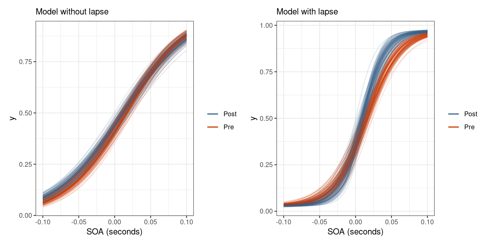
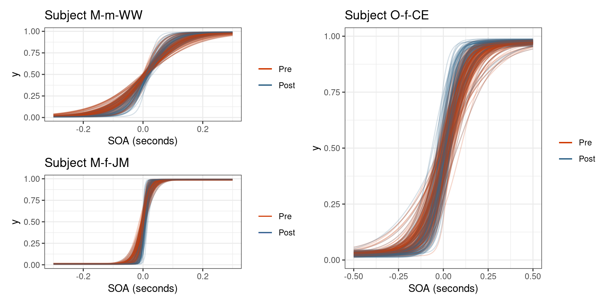

```{r setup, include=FALSE}
knitr::opts_chunk$set(echo = FALSE,
                      fig.height = 4.5,
                      fig.width = 9,
                      fig.align = "center",
                      comment = "#>",
                      warning = FALSE,
                      message = FALSE,
                      cache = TRUE)

library(tidyverse)
library(FangPsychometric)
library(kableExtra)
library(patchwork)
library(loo)
library(dagitty)

logit <- function(p) qlogis(p)
inv_logit <- function(x) plogis(x)
logistic <- function(x) inv_logit(x)
fn <- function(x, a, b) logistic(b * (x - a))
Q <- function(p, a, b) qlogis(p) / b + a
Q2 <- function(p, a, b, l) {
  logit((p - l) / (1 - 2*l)) / exp(b) + a
}

combine_samples <- function(post, age_group, block) {
  with(post, data.frame(
    age_group = age_group,
    block = block,
    alpha = a + aGT[,age_group,block],
    beta  = b + bGT[,age_group,block],
    lambda = lG[,age_group]
  ))
}

post_table <- function(post) {
  age_blk <- expand_grid(G=1:3, B=1:2)
  pmap(age_blk, ~ combine_samples(post, ..1, ..2)) %>%
    do.call(what = bind_rows) %>%
    mutate(age_group = factor(age_group,
                              levels = 1:3,
                              labels = c("Young", "Middle", "Older")),
           block = factor(block,
                          levels = 1:2,
                          labels = c("Pre", "Post"))) %>%
    rename(`Age Group` = age_group, Block = block) %>%
    mutate(gamma = 2 * lambda,
           PSS = Q2(0.5, alpha, beta, lambda),
           JND = Q2(0.84, alpha, beta, lambda) - PSS)
}

plot_pss <- function(df) {
  p1 <- ggplot(df, aes(PSS, fill = Block)) +
    geom_density(alpha = 0.75) +
    facet_grid(`Age Group` ~ .) +
    scale_fill_manual(values = two_colors) +
    theme_bw() +
    theme(legend.position = "bottom",
          axis.text.y = element_blank(),
          axis.title.y = element_blank(),
          axis.ticks.y = element_blank())

  p2 <- ggplot(df, aes(PSS, fill = `Age Group`)) +
    geom_density(alpha = 0.66) +
    facet_grid(Block ~ .) +
    scale_fill_manual(values = three_colors) +
    theme_bw() +
    theme(legend.position = "bottom",
          axis.text.y = element_blank(),
          axis.title.y = element_blank(),
          axis.ticks.y = element_blank())

  p1 + p2
}

plot_jnd <- function(df) {
  p1 <- ggplot(df, aes(JND, fill = Block)) +
    geom_density(alpha = 0.75) +
    facet_grid(`Age Group` ~ .) +
    scale_fill_manual(values = two_colors) +
    theme_bw() +
    theme(legend.position = "bottom",
          axis.text.y = element_blank(),
          axis.title.y = element_blank(),
          axis.ticks.y = element_blank())

  p2 <- ggplot(df, aes(JND, fill = `Age Group`)) +
    geom_density(alpha = 0.66) +
    facet_grid(Block ~ .) +
    scale_fill_manual(values = three_colors) +
    theme_bw() +
    theme(legend.position = "bottom",
          axis.text.y = element_blank(),
          axis.title.y = element_blank(),
          axis.ticks.y = element_blank())

  p1 + p2
}

two_colors   <- c("orangered3", "steelblue4")
three_colors <- c("goldenrod2", "turquoise3", "indianred4")

av  <- post_table(readRDS("../models/p044s_av.rds")) %>% 
  add_column(Task = "Audiovisual", .before = 1)
vis <- post_table(readRDS("../models/p044s_vis.rds")) %>% 
  add_column(Task = "Visual", .before = 1)
dur <- post_table(readRDS("../models/p044s_dur.rds")) %>% 
  add_column(Task = "Duration", .before = 1)
sm  <- post_table(readRDS("../models/p044s_sm.rds")) %>% 
  add_column(Task = "Sensorimotor", .before = 1)

post <- bind_rows(av, vis, dur, sm) %>%
  mutate(Task = factor(Task, levels = c("Audiovisual",
                                        "Visual",
                                        "Duration",
                                        "Sensorimotor")))
```


## Introduction

- A common neuroscience topic is to detect the temporal order of two stimuli
- These studies are often interested in making inferences at the group level and at an individual level
- Multilevel models allow for simultaneous estimation of population effects and group level effects
- Stan allows for flexible Bayesian modeling

<div class="notes">
A common neuroscience topic is to detect the temporal order of two stimuli. These studies are often interested in making inferences at the group level and at an individual level. Multilevel models allow for simultaneous estimation of population effects and group level effects. Stan is a PPL that does fully Bayesian statistical inference and allows for flexible models.
</div>

## Multilevel models

- In classical regression, a simple single-level slope-intercept model can be specified as
  - $y_i = \alpha + \beta x_i + \epsilon_i$
- If there is a categorical variable, then a varying-slopes varying-intercepts model can be specified as
  - $y_i = \alpha_{j[i]} + \beta_{j[i]} x_i + \epsilon_i$
- In a multilevel model, the coefficients are modeled by a separate regression
  - $$\begin{equation*}\begin{split} y_i &= \alpha_{j[i]} + \beta_{j[i]} x_i \\ \alpha_j &\sim \mathcal{N}(a_0 + a_1 u_j, \sigma_{\alpha}^2) \\ \beta_j &\sim \mathcal{N}(b_0 + b_1 u_j, \sigma_{\beta}^2) \\ \end{split}\end{equation*}$$

<div class="notes">
In classical regression, a simple single-level slope-intercept model can be specified as <<>> where all the data are pooled together to estimate a population slope and intercept. If there is a categorical variable, then a varying-slopes varying-intercepts model can be specified as <<>> where each level in the group has its own slope and intercept. There is no pooling between groups. In a multilevel model, the coefficients are modeled by a separate regression <<>>. In MLM, there is no need to drop one of the levels, and information is partially pooled between groups to estimate the group-level parameters.
</div>

## Bayesian statistics

The goal is to update our current state of information (the prior) with the incoming data (given its likelihood) to receive an entire probability distribution reflecting our new beliefs (the posterior), with all modeling assumptions made explicit

$$
P(\theta | data) = \frac{P(data | \theta) P(\theta)}{\int_\Omega P(data | \theta) P(\theta) d\theta}
$$

<div class="notes">
Prior knowledge must be stated explicitly in a given model and the entire posterior distribution is available to summarize, visualize, and draw inferences from. The prior $\pi(\theta)$ is some distribution over the parameter space and the likelihood $\pi(data | \theta)$ is the probability of an outcome in the sample space given a value in the parameter space.

The integral in the denominator is often intractable to compute, so we use MCMC to approximate it and draw samples directly from the posterior.
</div>


# Methods

<div class="notes">

</div>

## Hamiltonian Monte Carlo

- Physics-based simulation of a target distribution
- "Massless" particle is imparted with random kinetic energy and direction
  - The sum of potential and kinetic energy in the system is conserved along the trajectory
  - The path of the particle is a discrete approximation to the actual path
  - Position is updated in small steps
- http://chi-feng.github.io/mcmc-demo/
- https://arogozhnikov.github.io/2016/12/19/markov_chain_monte_carlo.html

<div class="notes">
Hamiltonian Monte Carlo is a physics-based 
Sum of PE and KE is called the Hamiltonian
</div>

## Model Checking

- Methods available to all MCMC samplers
  - Trace plots
  - Split $\hat{R}$
  - Effective sample size
- Divergent transitions
  - When the simulated trajectory is far from the true trajectory as measured by the Hamiltonian
  - Specific to HMC

## Estimating predictive performance

- Predictive performance is a reliable metric for model comparison 
- A model that can predict well likely captures the regular features of the observed data and the data generating model
- Can be estimated through leave-one-out cross-validation (LOOCV)
- LOOCV is expensive, but can be estimated through Pareto-smoothed importance sampling (PSIS)

<div class="notes">
Importance is measured by the log posterior-predictive distribution with the omitted sample

$$
\mathrm{lppd}(y, \Theta) = \sum_i \log \frac{1}{S} \sum_s p(y_i | \Theta_s)
$$
</div>

## Non-centered parameterization

$$
\begin{equation}
  \begin{split}
    X &\sim \mathcal{N}(\mu, \sigma^2)
  \end{split}
\quad \Longrightarrow \quad
  \begin{split}
    Z &\sim \mathcal{N}(0, 1^2) \\
    X &= \mu + \sigma \cdot Z
  \end{split}
\end{equation}
$$

$$
\begin{equation}
  \begin{split}
    X &\sim \mathrm{Lognormal}(\mu, \sigma^2)
  \end{split}
\quad \Longrightarrow \quad
  \begin{split}
    Z &\sim \mathcal{N}(0, 1^2) \\
    X &= \exp\left(\mu + \sigma \cdot Z\right)
  \end{split}
\end{equation}
$$

$$
\begin{equation}
  \begin{split}
    X &\sim \mathrm{Cauchy}(\mu, \tau)
  \end{split}
\quad \Longrightarrow \quad
  \begin{split}
    U &\sim \mathcal{U}\left(-\frac{\pi}{2}, \frac{\pi}{2}\right) \\
    X &= \mu + \tau \cdot \tan(U)
  \end{split}
\end{equation}
$$

<div class="notes">
Non-centered parameterization allows Stan to sample from simpler geometries (standard normal and uniform) and then transform to the intended distribution
</div>

# Background to Pyschometrics

## Short history

- Charles Darwin developed the idea that living organisms adapt in order to better survive in their environment
- Sir Francis Galton became interested in the differences in human beings and in how to measure those differences
- Johann Friedrich Herbart was interested in studying consciousness through the scientific method, and is responsible for creating mathematical models of the mind
- E.H. Weber sought out to prove the idea of a psychological threshold
  - A minimum stimulus intensity necessary to activate a sensory system
- G.T. Fechner devised Weber-Fechner Law that states that the strength of a sensation grows as the logarithm of the stimulus intensity


## Psychometric experiments

- If there are two distinct stimuli occurring nearly simultaneously then our brains will bind them into a single percept
- The temporal delay between stimuli is called the **stimulus onset asynchrony** (SOA)
- The range of SOAs for which sensory signals are integrated into a global percept is called the temporal binding window
- When the SOA grows large enough, the brain segregates the two signals and the temporal order can be determined

## Quantities of interest

- Perceptual Synchrony
  - The temporal delay between two signals at which an observer is unsure about their temporal order
  - Studied through the **point of subjective simultaneity** (PSS)
- Temporal Sensitivity
  - The ability to discriminate the timing of multiple sensory signals is referred to as temporal sensitivity
  - Studied through the **just noticeable difference** (JND)
  - The smallest lapse in time so that a temporal order can just be determined.

## Chart of the psychometric function

```{r}
ggplot(tibble(x = c(-4, 4), y = c(0, 1)), aes(x, y)) +
  geom_hline(yintercept = 0, lwd = 0.5) +
  geom_vline(xintercept = 0, lwd = 0.5) +
  stat_function(fun = plogis, args = list(location = 1), size = 1.5, 
                color = "steelblue") +
  geom_segment(aes(x = 0, xend = qlogis(0.5, 1), y = 0.5, yend = 0.5),
               lty = "dotted") +
  geom_segment(aes(x = qlogis(0.5, 1), xend = qlogis(0.5, 1), y = 0, yend = 0.5),
               lty = "dotted") +
  geom_segment(aes(x = 0, xend = qlogis(0.84, 1), y = 0.84, yend = 0.84),
               lty = "dotted") +
  geom_segment(aes(x = qlogis(0.84, 1), xend = qlogis(0.84, 1), y = 0, yend = 0.84),
               lty = "dotted") +
  annotate("segment", x = qlogis(0.5, 1), xend = qlogis(0.84, 1), 
           y = 0.25, yend = 0.25, size = 0.5, color = "gray32",
           arrow = arrow(ends = "both", type = "closed")) +
  annotate("label", x = mean(qlogis(c(0.5, 0.84), 1)), y = 0.25, label = "JND") +
  annotate("segment", 
           x = -1, xend = qlogis(0.5, 1),
           y = 0.84, yend = 0.5, color = "gray32",
           arrow = arrow(type = "closed")) +
  annotate("label", x = -1, y = 0.84, label = "PSS", hjust = 1, vjust = 0) +
  annotate("segment", x = -2, xend = -1.5, 
           y = 0.25, yend = plogis(-1.5, 1), color = "gray32",
           arrow = arrow(type = "closed")) +
  annotate("label", x = -2, y = 0.25, label = "F(x)", vjust = 0, hjust = 1) +
  scale_y_continuous(breaks = c(0, 0.5, 0.84, 1.0)) +
  theme(axis.ticks.x = element_blank(), axis.text.x = element_blank()) +
  labs(x = "Stimulus Intensity", y = "Response Probability",
       title = "Components of the Psychometric Function, F") +
  theme_bw()
```

## Psychometric research interests

- How age informs perceptual synchrony and temporal sensitivity
- How temporal recalibration affects perceptual synchrony and temporal sensitivity
- How age affects temporal recalibration

## Four temporal order judgment tasks

- Audiovisual - between an audible tone and a circle flashing on a screen
  - One subject's post-adaptation block removed from the data: `O-f-CE`
- Visual - between two circles flashing on a screen
- Duration - the time duration between two circles displayed on a screen
- Sensorimotor - between the press of a button and a circle flashed on a screen

<div class="notes">
```{r}
tibble(
  Task = c("Audiovisual", "Visual", "Sensorimotor", "Duration"),
  `Positive Response` = c("Perceived audio first", 
                          "Perceived right first", 
                          "Perceived visual first",
                          "Perceived bottom as longer"),
  `Positive SOA Truth` = c("Audio came before visual",
                           "Right came before left",
                           "Visual came before tactile",
                           "Bottom lasted longer than top")
)
```
</div>

## Glimpse at the data

```{r}
set.seed(4)
audiovisual_binomial %>% select(soa, k, n, sid, task, trial, age_group) %>%
  sample_frac()
```

# Developing a Model | for the Psychometric Function

## Modeling psychometric quantities

- Real-world properties inform modeling choices
  - PSS and JND quantities are estimated from the psychometric function
  - We have prior information about PSS and JND
- We have control over:
  - Choice of psychometric function
  - Choice of linear parameterization
  - Choice of priors

## Choice of psychometric function

<div class="columns-2">

```{r, fig.width=4.5}
ggplot(data.frame(x = c(-6, 6), y = c(0, 1)), aes(x, y)) +
  stat_function(aes(linetype = "Logistic"), fun = plogis) +
  stat_function(aes(linetype = "Gaussian"), fun = pnorm) +
  stat_function(aes(linetype = "Weibull"), 
                fun = pweibull, args = list(shape = 3)) +
  labs(title = "Assortment of Psychometric Functions") +
  theme_bw() + 
  theme(axis.title.x = element_blank(),
        axis.title.y = element_blank(),
        legend.title = element_blank(),
        legend.position = c(0.17, 0.75))
```

- Logistic and Gaussian have no skewness
- Gaussian puts predictor on standard (probit) scale
- Logistic puts predictor on log-odds (logit) scale
- Logistic is the "canonical" choice for Binomial regression

</div>


<div class="notes">
The logistic distribution has heavier tails, which often increases the robustness of analyses based on it compared with using the normal distribution

By rewriting the Bernoulli PMF in exponential family form, the natural parameter, $\theta$, is $\theta = \log(p/(1-p))$
</div>


## Logistic function

$$
F(\theta) = \frac{1}{1 + \exp(-\theta)}
$$


$$
F^{-1}(\pi) = \mathrm{logit}(\pi) = \ln\left(\frac{\pi}{1-\pi}\right)
$$

The "link" is the logit function

$$
\pi = F(\theta) \Longleftrightarrow F^{-1}(\pi) = F^{-1}(F(\theta)) = \theta
$$

<div class="notes">
Link function relates a linear predictor to the response variable
</div>

## Choice of linear parameterization {.smaller}

The PSS and JND are defined as

$$
\begin{align*}
pss &:= F^{-1}(0.5; \alpha, \beta) \\
jnd &:= F^{-1}(0.84; \alpha, \beta) - F^{-1}(0.5; \alpha, \beta)
\end{align*}
$$

"Slope-intercept" linear parameterization

$$
\begin{equation*}
\theta = \alpha + \beta x
\Longrightarrow
\begin{split}
pss &= -\frac{\alpha}{\beta} \\
jnd &= \frac{\mathrm{logit}(0.84)}{\beta}
\end{split}
\end{equation*}
$$

"Slope-location" linear parameterization

$$
\begin{equation*}
\theta = \beta (x - \alpha)
\Longrightarrow
\begin{split}
pss &= \alpha \\
jnd &= \frac{\mathrm{logit}(0.84)}{\beta}
\end{split}
\end{equation*}
$$

<div class="notes">
Linear parameterization doesn't affect inferential results

Choice makes setting priors easier
</div>

## Conceptual analysis

- Subjects are presented with two stimuli separated by some temporal delay
- They are asked to respond as to their perception of the temporal order
- As the SOA becomes larger in the positive direction, subjects are expected to give more “positive” responses
- After the first experimental block the subjects go through a temporal recalibration period, and repeat the experiment

## Observational space

- The response that subjects give during a TOJ task is recorded as a zero or a one
  - $y_i \in \lbrace 0, 1\rbrace$
- If the SOA values are fixed then we have repeated measurements for each SOA and the responses can be aggregated into Binomial counts
  - $k_i, n_i \in \mathbb{Z}_0^+, k_i \le n_i$
  - $k_i \sim \mathrm{Binomial}(n_i, p_i)$
  
## Selecting priors - Point of subjective simultaneity

- The point of subjective simultaneity can be either positive or negative
- Some studies suggest that the separation between stimuli need to be as little as 20ms for subjects to be able to determine temporal order
- Other studies suggest that our brains can detect temporal differences as small as 30ms
- We should be skeptical of PSS estimates larger than say 150ms in absolute value
- $$pss \sim \mathcal{N}(0, 0.06^2) \Longleftrightarrow \alpha \sim \mathcal{N}(0, 0.06^2)$$

## Selecting priors - Just noticeable difference

- It is impossible that a properly conducted block would result in a JND less than 0
- It is also unlikely that the just noticeable difference would be more than a second
- Some studies show that an input lag as small as 100ms can impair a person’s typing ability
- Use Log-Normal distribution to model the JND
- *a priori* set prior so that $median[X] \approx 0.100$ and $P(X < 1) \approx 0.99$
  - $$jnd \sim \mathrm{Lognormal}(-2.3, 1^2)$$
  - $$\beta = \frac{\mathrm{logit}(0.84)}{jnd} \Longleftrightarrow \beta \sim \mathrm{Lognormal}(2.8, 1^2)$$
  
<div class="notes">
The log-normal distribution has a reciprocal property that makes setting a prior for $\beta$ easier

We use the _median_ because the expected value depends on both the mean and the standard deviation which makes selecting a prior difficult
</div>

## Baseline model

<div class="columns-2">

$$
\begin{equation*}
  \begin{split}
    k_i &\sim \mathrm{Binomial}(n_i, p_i) \\
    \mathrm{logit}(p_i) &= \beta \cdot (x_i - \alpha) \\
    \alpha &\sim \mathcal{N}(0, 0.06^2) \\
    \beta &\sim \mathrm{Lognormal}(3, 1^2)
  \end{split}
\end{equation*}
$$

```
model {
  vector[N] p = beta * (x - alpha);
  alpha ~ normal(0, 0.06);
  beta ~ lognormal(3.0, 1.0);
  k ~ binomial_logit(n, p);
}
```

</div>

<div class="notes">
The number of "positve" responses in $n$ trials
</div>

## Prior predictive checks - psychometric function

```{r}
set.seed(124)
n <- 10000
a <- rnorm(n, 0, 0.06)
b <- rlnorm(n, 3.0, 1)

p <- data.frame(x = c(-0.5, 0.5), y = c(0, 1)) %>% ggplot(aes(x, y)) +
  labs(x = "SOA", title = "Prior distribution of psychometric functions") +
  theme(axis.title.y = element_blank())
for (i in 1:100) {
  p <- p +
    geom_function(fun = fn, args = list(a = a[i], b = b[i]),
                  color = "steelblue4", alpha = 0.25)
}

p + theme_bw()
```

## Prior predictive checks - PSS and JND

```{r}
p1 <- ggplot(data.frame(x = Q(0.5, a, b)), aes(x = x, y = ..density..)) +
  geom_vline(xintercept = c(-0.15, 0.15), color = "red", linetype = "dashed") +
  geom_histogram(bins = 50) +
  labs(x = "seconds",
       title = "Prior distribution for the PSS") +
  theme_bw() +
  theme(axis.title.y = element_blank(),
        axis.text.y = element_blank(),
        axis.ticks.y = element_blank())

p2 <- ggplot(data.frame(x = Q(0.84, a, b) - Q(0.5, a, b)), aes(x = x, y = ..density..)) +
  geom_vline(xintercept = 1, color = "red", linetype = "dashed") +
  geom_histogram(bins = 50) +
  labs(x = "seconds",
       title = "Prior distribution for the JND") +
  scale_x_continuous(limits = c(0, 1.5)) +
  theme_bw() +
  theme(axis.title.y = element_blank(),
        axis.text.y = element_blank(),
        axis.ticks.y = element_blank())

p1 + p2
```

## Adding age and block

- Age and block are categorical variables
- They are necessary to answer the question of how age informs perceptual synchrony and temporal sensitivity

## Three ways to add a categorical variable

$$
\begin{equation}
  \begin{split}
    \mu_\alpha &= \alpha_{trt[i]} \\
    \alpha_{trt} &\sim \mathcal{N}(0, 0.06^2)
  \end{split}
\qquad
  \begin{split}
    \mu_\alpha &= \alpha_{trt[i]} \\
    \alpha &\sim \mathcal{N}(0, 0.06^2) \\
    \alpha_{trt} &\sim \mathcal{N}(\alpha, \sigma_{trt}^2) \\
    \sigma_{trt} &\sim \pi_{\sigma}
  \end{split}
\qquad
  \begin{split}
    \mu_\alpha &= \alpha + \alpha_{trt[i]} \\
    \alpha &\sim \mathcal{N}(0, 0.06^2) \\
    \alpha_{trt} &\sim \mathcal{N}(0, \sigma_{trt}^2) \\
    \sigma_{trt} &\sim \pi_{\sigma}
  \end{split}
\end{equation}
$$

- (Left) Categorical variable replaces the intercept so each level explicitly gets its own intercept
- (Center) Each categorical variable is modeled as having the same mean and standard deviation that is learned from the data (centered multilevel)
- (Right) Same as center, but using the non-centered parameterization
  - Most convenient when adding multiple categorical variables

<div class="notes">
Why not dummy variables? Dummy variables explicitly set one of the levels to be a "baseline"
</div>

## Using the non-centered log-normal parameterization

$$
\begin{align*}
X &\sim \mathcal{N}(3, 1^2) \\
Y &= \exp\left(X\right) \Longleftrightarrow Y \sim \mathrm{Lognormal(3, 1^2)}
\end{align*}
$$

Adding categorical variables to the slope term is more tractable

$$
\begin{equation}
\begin{split}
k_i &\sim \mathrm{Binomial}(n_i, p_i) \\
\mathrm{logit}(p_i) &= \exp(\mu_\beta) (x_i - \mu_\alpha) \\
\mu_\alpha &= \alpha + \alpha_{trt[i]} + \alpha_{G[i]} \\
\mu_\beta &= \beta + \beta_{trt[i]} + \beta_{G[i]} \\
\end{split}
\end{equation}
$$

## Model 2 - Checking the posterior

```{r}
m042 <- readRDS("../models/m042.rds")
m042nc <- readRDS("../models/m042nc.rds")
p_trace <- bayesplot::mcmc_trace(m042nc, pars = c("a", "b"), 
                                 facet_args = list(ncol=1))

pars <- c(
  "a", "b", 
  "aG", "bG",
  "aT", "bT",
  "sd_aG", "sd_bG",
  "sd_aT", "sd_bT",
  "pss", "jnd")
cp_neff <- bayesplot::neff_ratio(m042, pars = pars)
ncp_neff <- bayesplot::neff_ratio(m042nc, pars = pars)
p_ncp <- bayesplot::mcmc_neff(ncp_neff) + 
  labs(title = "Non-centered Parameterization")
p_cp <- bayesplot::mcmc_neff(cp_neff) + 
  labs(title = "Centered Parameterization")

p_trace | (p_cp / p_ncp)
```

## Model 2 - Posterior predictive distribution

```{r}
p042 <- rstan::extract(readRDS("../models/m042.rds"))
posterior_pss <- bind_rows(
  tibble(`Age Group` = "Young",  Block = "Pre",  value = 1000*p042$pss[,1,1]),
  tibble(`Age Group` = "Young",  Block = "Post", value = 1000*p042$pss[,1,2]),
  tibble(`Age Group` = "Middle", Block = "Pre",  value = 1000*p042$pss[,2,1]),
  tibble(`Age Group` = "Middle", Block = "Post", value = 1000*p042$pss[,2,2]),
  tibble(`Age Group` = "Older",  Block = "Pre",  value = 1000*p042$pss[,3,1]),
  tibble(`Age Group` = "Older",  Block = "Post", value = 1000*p042$pss[,3,2])
) %>%
  mutate(`Age Group` = factor(`Age Group`, levels = c("Young", "Middle", "Older")),
         Block = factor(Block, levels = c("Pre", "Post")))
posterior_jnd <- bind_rows(
  tibble(`Age Group` = "Young",  Block = "Pre",  value = 1000*p042$jnd[,1,1]),
  tibble(`Age Group` = "Young",  Block = "Post", value = 1000*p042$jnd[,1,2]),
  tibble(`Age Group` = "Middle", Block = "Pre",  value = 1000*p042$jnd[,2,1]),
  tibble(`Age Group` = "Middle", Block = "Post", value = 1000*p042$jnd[,2,2]),
  tibble(`Age Group` = "Older",  Block = "Pre",  value = 1000*p042$jnd[,3,1]),
  tibble(`Age Group` = "Older",  Block = "Post", value = 1000*p042$jnd[,3,2])
) %>%
  mutate(`Age Group` = factor(`Age Group`, levels = c("Young", "Middle", "Older")),
         Block = factor(Block, levels = c("Pre", "Post")))

p_pss <- ggplot(posterior_pss, aes(x = value, fill=Block)) +
  geom_density(alpha=0.5) +
  theme_bw() + 
  theme(axis.text.y = element_blank(),
        axis.title.y = element_blank(),
        axis.ticks.y = element_blank()) +
  labs(x = "milliseconds",
       title = "Posterior Distribution for the PSS") +
  facet_wrap(~ `Age Group`) +
  scale_fill_manual(values = c("orangered3", "steelblue4"))

p_jnd <- ggplot(posterior_jnd, aes(x = value, fill=Block)) +
  geom_density(alpha=0.5) +
  theme_bw() + 
  theme(axis.text.y = element_blank(),
        axis.title.y = element_blank(),
        axis.ticks.y = element_blank()) +
  labs(x = "milliseconds",
       title = "Posterior Distribution for the JND") +
  facet_wrap(~ `Age Group`) +
  scale_fill_manual(values = c("orangered3", "steelblue4"))

p_pss / p_jnd
```

## Modeling interactions

- There is a problem with the previous model
  - It measures the average difference in blocks, and the average difference in age groups
  - Does not consider any interaction between the two
  - Model assumes that temporal recalibration affects all age groups the same
- Modeling interactions between categorical variables by creating a new categorical variable
  - Cross-product between factor levels
  - If $A$ has levels $a, b, c$ and $B$ has levels $x, y$, then the interaction variable $C=A\times B$ will have levels $ax, ay, bx, by, cx, cy$
  
## Model 3 - Posterior predictive distribution

```{r}
p043 <- rstan::extract(readRDS("../models/m043.rds"))
posterior_pss <- bind_rows(
  tibble(`Age Group` = "Young",  Block = "Pre",  value = 1000*p043$pss[,1,1]),
  tibble(`Age Group` = "Young",  Block = "Post", value = 1000*p043$pss[,1,2]),
  tibble(`Age Group` = "Middle", Block = "Pre",  value = 1000*p043$pss[,2,1]),
  tibble(`Age Group` = "Middle", Block = "Post", value = 1000*p043$pss[,2,2]),
  tibble(`Age Group` = "Older",  Block = "Pre",  value = 1000*p043$pss[,3,1]),
  tibble(`Age Group` = "Older",  Block = "Post", value = 1000*p043$pss[,3,2])
) %>%
  mutate(`Age Group` = factor(`Age Group`, levels = c("Young", "Middle", "Older")),
         Block = factor(Block, levels = c("Pre", "Post")))
posterior_jnd <- bind_rows(
  tibble(`Age Group` = "Young",  Block = "Pre",  value = 1000*p043$jnd[,1,1]),
  tibble(`Age Group` = "Young",  Block = "Post", value = 1000*p043$jnd[,1,2]),
  tibble(`Age Group` = "Middle", Block = "Pre",  value = 1000*p043$jnd[,2,1]),
  tibble(`Age Group` = "Middle", Block = "Post", value = 1000*p043$jnd[,2,2]),
  tibble(`Age Group` = "Older",  Block = "Pre",  value = 1000*p043$jnd[,3,1]),
  tibble(`Age Group` = "Older",  Block = "Post", value = 1000*p043$jnd[,3,2])
) %>%
  mutate(`Age Group` = factor(`Age Group`, levels = c("Young", "Middle", "Older")),
         Block = factor(Block, levels = c("Pre", "Post")))

p_pss <- ggplot(posterior_pss, aes(x = value, fill=Block)) +
  geom_density(alpha=0.5) +
  theme_bw() +
  theme(axis.text.y = element_blank(),
        axis.title.y = element_blank(),
        axis.ticks.y = element_blank()) +
  labs(x = "milliseconds",
       title = "Posterior Distribution for the PSS") +
  facet_wrap(~ `Age Group`) +
  scale_fill_manual(values = c("orangered3", "steelblue4"))

p_jnd <- ggplot(posterior_jnd, aes(x = value, fill=Block)) +
  geom_density(alpha=0.5) +
  theme_bw() + 
  theme(axis.text.y = element_blank(),
        axis.title.y = element_blank(),
        axis.ticks.y = element_blank()) +
  labs(x = "milliseconds",
       title = "Posterior Distribution for the JND") +
  facet_wrap(~ `Age Group`) +
  scale_fill_manual(values = c("orangered3", "steelblue4"))

p_pss / p_jnd
```

## Incorporating a lapse rate

- A lapse in judgment can happen for any reason, and is assumed to be random and independent of other lapses
- Lapses can be modeled as occurring independently at some fixed rate
- The underlying psychometric function, $F$, is bounded by some lower and upper lapse rate
- For a given lower and upper lapse rate $\lambda$ and $\gamma$, the performance function $\Psi$ is
  - $$\Psi(x; \alpha, \beta, \lambda, \gamma) = \lambda + (1 - \lambda - \gamma) F(x; \alpha, \beta)$$

<div class="notes">
They can come in the form of the subject accidentally blinking during the presentation of a visual stimulus, or unintentionally pressing the wrong button to respond.

Lapses can have a significant affect on the estimation of the psychometric function.
</div>

## Chart of a lapse rate model

```{r}
fn_lapse <- function(x, a=0, b=1, l=0, g=0) l + (1 - l - g) * fn(x, a, b)

ggplot(tibble(x = c(-4, 6), y = c(0, 1)), aes(x, y)) +
  geom_hline(yintercept = 0, lwd = 0.5) +
  geom_vline(xintercept = 0, lwd = 0.5) +
  stat_function(fun = fn_lapse, 
                args = list(a = 1), 
                size = 1, alpha = 0.5,
                color = "steelblue4") +
  stat_function(fun = fn_lapse, 
                args = list(a = 1, l=0.05, g=0.11), 
                size = 1.5, 
                color = "orangered3") +
  geom_hline(yintercept = 0.05, linetype="dashed") +
  geom_hline(yintercept = 1-0.11, linetype="dashed") +
  annotate("segment", 
           x = -2, xend = -1, 
           y = 0.45, yend = fn_lapse(-1, a=1, l=0.05, g=0.11), 
           color = "gray32", arrow = arrow(type = "closed")) +
  annotate("label", x = -2, y = 0.45, label = "Ψ(x)", vjust = 0, hjust = 1) +
  annotate("segment", x = -2, xend = -1.5, 
           y = 0.25, yend = plogis(-1.5, 1), color = "gray32",
           arrow = arrow(type = "closed")) +
  annotate("label", x = -2, y = 0.25, label = "F(x)", vjust = 0, hjust = 1) +
  theme_bw() +
  theme(axis.ticks.x = element_blank(), axis.text.x = element_blank()) +
  labs(x = "Stimulus Intensity", y = "Probability",
       title = "Psychometric function with lower and upper performance bounds")
```

<div class="notes">
Psychometric function can be steeper in the middle and still allow for variability at the outer SOAs
</div>

## Modeling the lapse rate

$$
\begin{equation}
\begin{split}
k_i &\sim \mathrm{Binomial}(n_i, p_i) \\
p_i &= \lambda + (1 - 2\lambda)\cdot F\left(\exp(\mu_\beta) (x_i - \mu_\alpha)\right) \\
\mu_\alpha &= \alpha + \alpha_{G[i] \times trt[i]} \\
\mu_\beta &= \beta + \beta_{G[i] \times trt[i]} \\
\end{split}
\end{equation}
$$

```
model {
  vector[N] p;
  for (i in 1:N) {
    real mu_b = b + bGT[G[i], trt[i]];
    real mu_a = a + aGT[G[i], trt[i]];
    p[i] = lG[G[i]] + (1 - 2*lG[G[i]]) * inv_logit(exp(mu_b) * (x[i] - mu_a));
  }
  k ~ binomial(n, p);
}
```


## Result of modeling a lapse rate

```{r lapse-v-no-lapse}
# n <- 100
# p043vis <- rstan::extract(readRDS("../models/m043vis.rds"))
# idx <- sample(1:length(p043vis$a), n, replace = TRUE)
# 
# i <- 3
# p <- data.frame(x = c(-0.1, 0.1), y = c(0, 1)) %>%
#   ggplot(aes(x, y)) +
#   theme(axis.title.y = element_blank()) +
#   labs(x = "SOA (seconds)", subtitle = "Model without lapse")
# alpha_pre <- with(p043vis, a + aGT[,i,1])
# alpha_pos <- with(p043vis, a + aGT[,i,2])
# beta_pre <- exp(with(p043vis, b + bGT[,i,1]))
# beta_pos <- exp(with(p043vis, b + bGT[,i,2]))
# for (j in idx) {
#   p <- p +
#     geom_function(fun = fn, args = list(a = alpha_pre[j], b = beta_pre[j]),
#                   alpha = 0.15, aes(color = "Pre")) +
#     geom_function(fun = fn, args = list(a = alpha_pos[j], b = beta_pos[j]),
#                   alpha = 0.15, aes(color = "Post"))
# }
# pnl <- p +
#   scale_color_manual(values = c("steelblue4", "orangered3")) +
#   theme_bw() +
#   theme(legend.title = element_blank())
# 
# fn2 <- function(x, a, b, l) {
#   l + (1-2*l) * fn(x, a, b)
# }
# 
# p044 <- rstan::extract(readRDS("../models/m044vis.rds"))
# idx <- sample(1:length(p044$a), n, replace = TRUE)
# 
# p <- data.frame(x = c(-0.1, 0.1), y = c(0, 1)) %>%
#   ggplot(aes(x, y)) +
#   theme(axis.title.y = element_blank()) +
#   labs(x = "SOA (seconds)", subtitle = "Model with lapse")
# 
# alpha_pre <- with(p044, a + aGT[,i,1])
# alpha_pos <- with(p044, a + aGT[,i,2])
# beta_pre <- exp(with(p044, b + bGT[,i,1]))
# beta_pos <- exp(with(p044, b + bGT[,i,2]))
# 
# lambda <- with(p044, lG[,i])
# 
# for (j in idx) {
#   p <- p +
#     geom_function(fun = fn2, args = list(a = alpha_pre[j],
#                                          b = beta_pre[j],
#                                          l = lambda[j]),
#                   alpha = 0.15, aes(color = "Pre")) +
#     geom_function(fun = fn2, args = list(a = alpha_pos[j],
#                                          b = beta_pos[j],
#                                          l = lambda[j]),
#                   alpha = 0.15, aes(color = "Post"))
# }
# 
# pl <- p +
#   scale_color_manual(values = c("steelblue4", "orangered3")) +
#   theme_bw() +
#   theme(legend.title = element_blank())
# 
# p <- pnl + pl
# ggsave(
#   filename = "lapse-v-no-lapse.png",
#   plot = p,
#   device = "png",
#   width = 9,
#   height = 4.5,
#   dpi = 192,
#   path = "../figures/")

```


## Including a lapse rate improves predictive performance


```{r, cache=TRUE, echo=TRUE}
l043 <- loo(readRDS("../models/m043vis.rds"))
l044 <- loo(readRDS("../models/m044vis.rds"))
comp_vis <- loo_compare(l043, l044)
```

```{r}
comp_vis %>%
  as_tibble(rownames = "Model") %>%
  mutate(Model = factor(Model, 
                        levels = paste0("model", 1:2),
                        labels = c("No Lapse", 
                                   "Lapse"))) %>%
  select(-c(se_elpd_loo, looic, se_looic))
```


## Adding subjects

- Some researchers are interested in making inferences at an individual level
- Modeling at the subject level can improve 

## Final model {.smaller}

$$
\begin{equation*}
  \begin{split}
    k_i &\sim \mathrm{Binomial}(n_i, p_i) \\
    p_i &= \lambda_{G[i]} + (1 - 2\lambda_{G[i]})\exp(\mu_\beta) (x_i - \mu_\alpha) \\
    \mu_\alpha &= \alpha + \alpha_{G[i], trt[i]} + \alpha_{S[i]} \\
    \mu_\beta &= \beta + \beta_{G[i], trt[i]} + \beta_{S[i]} \\
    \lambda_{G} &\sim \mathrm{Beta}(4, 96) \\
    \hat{\alpha}, \hat{\alpha}_{G\times trt}, \hat{\alpha}_{S} &\sim \mathcal{N}(0, 1^2) \\
    \hat{\beta}, \hat{\beta}_{G\times trt}, \hat{\beta}_{S} &\sim \mathcal{N}(0, 1^2) \\
    \hat{\sigma}_{G\times trt}, \hat{\gamma}_{G\times trt}, \hat{\tau}_{S}, \hat{\nu}_{S} &\sim \mathcal{U}(0, \pi/2) \\
  \end{split}
\qquad
  \begin{split}
    \alpha &= 0.06 \cdot \hat{\alpha} \\
    \alpha_{G\times trt} &= \sigma_{G\times trt} \cdot \hat{\alpha}_{trt} \\
    \alpha_{S} &= \tau_{S} \cdot \hat{\alpha}_{S} \\
    \sigma_{G \times trt} &= \tan(\hat{\sigma}_{G \times trt}) \\
    \tau_{S} &= \tan(\hat{\tau}_{S}) \\
    \beta &= 3 + 1 \cdot \hat{\beta} \\
    \beta_{G\times trt} &= \gamma_{G\times trt} \cdot \hat{\beta}_{G\times trt} \\
    \beta_{S} &= \nu_{S} \cdot \hat{\beta}_{S} \\
    \gamma_{G\times trt} &= \tan(\hat{\gamma}_{G\times trt}) \\
    \nu_{S} &= \tan(\hat{\nu}_{S})
  \end{split}
\end{equation*}
$$


# Results

## On perceptual synchrony (PSS)

- Temporal recalibration has a small-yet-consistent affect on audio-visual TOJ
- The visual TOJ task shows some evidence for differences between age groups
- Temporal recalibration has an affect for the duration TOJ task

## PSS - Audiovisual

```{r}
plot_pss(av) +
  plot_annotation(title = "PSS - Audiovisual TOJ")
```

## PSS - Visual

```{r}
plot_pss(vis) +
  plot_annotation(title = "PSS - Visual TOJ")
```

## PSS - Duration

```{r}
plot_pss(dur) +
  plot_annotation(title = "PSS - Duration TOJ")
```

## PSS - Sensorimotor

```{r}
plot_pss(sm) +
  plot_annotation(title = "PSS - Sensorimotor TOJ")
```

## On temporal sensitivity

- Temporal recalibration increases temporal sensitivity in the audiovisual and visual TOJ tasks
- The older age group generally lags behind the younger and middle age groups
- There are no visually significant changes in the duration TOJ task
- The younger age group saw heighten temporal sensitivity in the sensorimotor TOJ task

## JND - Audiovisual

```{r}
plot_jnd(av) +
  plot_annotation(title = "JND - Audiovisual TOJ")
```

## JND - Visual

```{r}
plot_jnd(vis) +
  plot_annotation(title = "JND - Visual TOJ")
```

## JND - Duration

```{r}
plot_jnd(dur) +
  plot_annotation(title = "JND - Duration TOJ")
```

## JND - Sensorimotor

```{r}
plot_jnd(sm) +
  plot_annotation(title = "JND - Sensorimotor TOJ")
```

## Lapses

```{r}
ggplot(post, aes(gamma, fill = `Age Group`)) +
  geom_density(alpha = 0.75) +
  scale_fill_manual(values = three_colors) +
  facet_grid(Task ~ ., scales = "free_y") +
  theme_bw() +
  theme(axis.text.y = element_blank(),
        axis.title.y = element_blank(),
        axis.ticks.y = element_blank()) +
  labs(x = "Lapse Rate",
       title = "Distribution of lapse rates across tasks")
```

## Subject level inferences

```{r}
Q3 <- function(p, a, b, l) {
  logit((p - l) / (1 - 2*l)) / exp(b) + a
}

fn2 <- function(x, a, b, l) {
    l + (1-2*l) * logistic(exp(b)*(x - a))
}

p044s_vis <- readRDS("../models/p044s_vis.rds")
age_sid <- visual_binomial %>%
  filter(trial %in% c("pre", "post1")) %>%
  select(age_group, sid) %>%
  distinct()

combine_samples_2 <- function(post, block, sid) {
  age_group = as.integer(age_sid$age_group[sid])
  with(post, data.frame(
    block = block,
    subject = levels(age_sid$sid)[sid],
    alpha = a + aGT[,age_group,block] + aS[,sid],
    beta  = b + bGT[,age_group,block] + bS[,sid],
    lambda = lG[,age_group]
  ))
}

post_table_2 <- function(post, sid) {
  map(c(1, 2), ~ combine_samples_2(post, .x, sid)) %>%
    do.call(what = bind_rows) %>%
    mutate(block = factor(block,
                          levels = 1:2,
                          labels = c("Pre", "Post"))) %>%
    rename(Block = block) %>%
    mutate(gamma = 2 * lambda,
           PSS = Q3(0.5, alpha, beta, lambda),
           JND = Q3(0.84, alpha, beta, lambda) - PSS)
}

plot_vis_sub <- function(n, i) {
  vis_sub <- post_table_2(p044s_vis, i)
  vis_smpl <- vis_sub %>% group_by(Block) %>% sample_n(n) %>% ungroup()
  
  p <- data.frame(x = c(-0.3, 0.3), y = c(0, 1)) %>% 
    ggplot(aes(x, y)) +
    theme(axis.title.y = element_blank()) +
    labs(x = "SOA (seconds)",
         title = paste("Subject", age_sid$sid[i]))
  
  for (j in 1:(nrow(vis_smpl)/2)) {
    p <- p +
      geom_function(fun = fn2, args = list(a = vis_smpl$alpha[j], 
                                           b = vis_smpl$beta[j],
                                           l = vis_smpl$lambda[j]),
                    alpha = 0.2, 
                    aes(color = "Pre")) +
      geom_function(fun = fn2, args = list(a = vis_smpl$alpha[j*2], 
                                           b = vis_smpl$beta[j*2],
                                           l = vis_smpl$lambda[j*2]),
                    alpha = 0.2, 
                    aes(color = "Post"))
  }
  p +
    scale_color_manual(values = two_colors, breaks = c("Pre", "Post")) +
    theme_bw() + 
    theme(legend.title = element_blank())
}

p044s_av <- readRDS("../models/p044s_av.rds")
age_sid2 <- audiovisual_binomial %>%
  filter(trial %in% c("pre", "post1"),
         rid != "av-post1-O-f-CE") %>%
  select(age_group, sid) %>%
  distinct()

combine_samples_3 <- function(post, block, sid) {
  age_group = as.integer(age_sid2$age_group[sid])
  with(post, data.frame(
    block = block,
    subject = levels(age_sid2$sid)[sid],
    alpha = a + aGT[,age_group,block] + aS[,sid],
    beta  = b + bGT[,age_group,block] + bS[,sid],
    lambda = lG[,age_group]
  ))
}

post_table_3 <- function(post, sid) {
  map(c(1, 2), ~ combine_samples_3(post, .x, sid)) %>%
    do.call(what = bind_rows) %>%
    mutate(block = factor(block,
                          levels = 1:2,
                          labels = c("Pre", "Post"))) %>%
    rename(Block = block) %>%
    mutate(gamma = 2 * lambda,
           PSS = Q3(0.5, alpha, beta, lambda),
           JND = Q3(0.84, alpha, beta, lambda) - PSS)
}

plot_av_sub <- function(n, i) {
  av_sub <- post_table_3(p044s_av, i)
  av_smpl <- av_sub %>% group_by(Block) %>% sample_n(n) %>% ungroup()
  
  p <- data.frame(x = c(-0.5, 0.5), y = c(0, 1)) %>% 
    ggplot(aes(x, y)) +
    theme(axis.title.y = element_blank()) +
    labs(x = "SOA (seconds)",
         title = paste("Subject", age_sid2$sid[i]))
  
  for (j in 1:(nrow(av_smpl)/2)) {
    p <- p +
      geom_function(fun = fn2, args = list(a = av_smpl$alpha[j], 
                                           b = av_smpl$beta[j],
                                           l = av_smpl$lambda[j]),
                    alpha = 0.2, 
                    aes(color = "Pre")) +
      geom_function(fun = fn2, args = list(a = av_smpl$alpha[j*2], 
                                           b = av_smpl$beta[j*2],
                                           l = av_smpl$lambda[j*2]),
                    alpha = 0.2, 
                    aes(color = "Post"))
  }
  p +
    scale_color_manual(values = two_colors, breaks = c("Pre", "Post")) +
    theme_bw() + 
    theme(legend.title = element_blank())
}
```


- Modeling subjects allows for comparison between subjects
- Highlights the variation within groups
- Can be used to make predictions for subjects that only partially participated in a task
  - Subject `O-f-CE` completed the pre-adaptation block, but was removed from the post-adaptation block
  
## Subject-specific examples

```{r}
# p1 <- plot_vis_sub(100, 15)
# p2 <- plot_vis_sub(100, 4)
# p3 <- plot_av_sub(150, 44)
# 
# p <- (p1 / p2) | p3
# ggsave(
#   filename = "subject-specific.png",
#   plot = p,
#   device = "png",
#   width = 9,
#   height = 4.5,
#   dpi = 192,
#   path = "../figures/")

```

# Discussion

## Improving psychometric experiments

- The results here are based on small-scale preliminary data
- There is an inherent difficulty for the different tasks
  - Visual -> Audiovisual -> Duration -> Sensorimotor
  - Indicated by temporal sensitivity and lapse rates
- Lapses should be independent of the task
  - Distribution of lapse rates across ages and tasks shows this assumption is violated
  - Better estimation of lapse rates by presenting larger SOAs in the experiment
- In the visual TOJ task, the granularity in the SOA values near the PSS could be increased to get more reliable estimates of the slope and to avoid complete separation

## Future work

- Fitting a multitask model
  - Borrowing information across different groups improves parameter estimation
- Explore a causal inference model for the psychometric function
  - Current model only measures association between temporal recalibration and the PSS/JND
- Improve estimation of predictive performance by considering leave-one-group-out cross-validation

## Conclusion

- We have 

# Thank you
